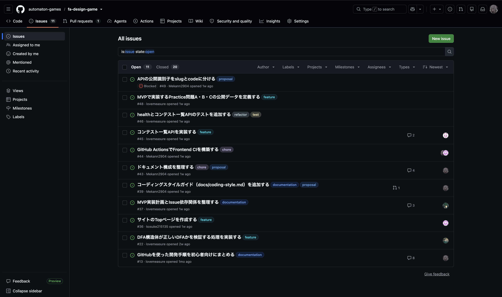

# Issueを選ぶ

> [← 目次に戻る](README.md) | [次: 04 自分をAssignする](04-assign-yourself.md)

## このページで扱うこと

Issueとは、GitHub上で作業を記録し、管理するためのものです。
「この不具合を直す」「このドキュメントを書く」など、ひとまとまりの作業を1つのIssueとして扱います。
このページでは、着手するIssueを探し、内容を読む手順を説明します。

## なぜIssueを選ぶのか

このプロジェクトでは、すべての作業をIssueとして扱い、開発はIssueを選ぶことから始まります。
理由は、チームで作業を重ねてしまわないようにするためです。
誰もが勝手に作業を始めると、同じものを二人で進めたり、必要でないことに手を出したりします。

Issueを選んで担当を決めると、誰が何をしているかがチーム全体に伝わります。
作業が重なるのを防げる上に、Issueの完了条件によって「どこまでやれば終わりか」も分かります。

そのため、まずは自分が扱うIssueを選びます。

## Issueを探す

リポジトリの `Issues` タブを開きます。
既定ではOpen（未完了）のIssue一覧が表示されます。

着手できそうなIssueを探します。
次の点を確認してください。

- ラベル：作業の種類（`bug`、`feature`、`documentation` など）を表す
- タイトルと概要：何をするIssueかが分かるか
- Assignees：すでに誰かが担当していないか
- `blocked` ラベル：今は着手できないIssueの印

ラベルの意味は [CONTRIBUTING.md の「ラベル」](../CONTRIBUTING.md#ラベル) にまとまっています。
GitHub初心者は、`documentation` や `chore` など、コードを大きく変えないIssueから始めると着手しやすいです。

## Issueを読む

このリポジトリでは、Issue本文は次の見出しで構成されます。

- **概要**：何をするIssueか
- **やること**：作業のチェックリスト
- **完了条件**：Issueを完了とみなす条件
- **補足**：関連ドキュメントや注意点（空欄でもよい）

「やること」と「完了条件」を最後まで読み、自分にできそうか判断します。
コメント欄に過去の議論がある場合は、あわせて読んでください。

## 次のステップ

作業できそうなIssueが見つかったら、次は自分をAssignします。
[04 自分をAssignする](04-assign-yourself.md) へ進んでください。

## 関連

- [CONTRIBUTING.md - Issueの運用](../CONTRIBUTING.md#issueの運用)
- [CONTRIBUTING.md - ラベル](../CONTRIBUTING.md#ラベル)
