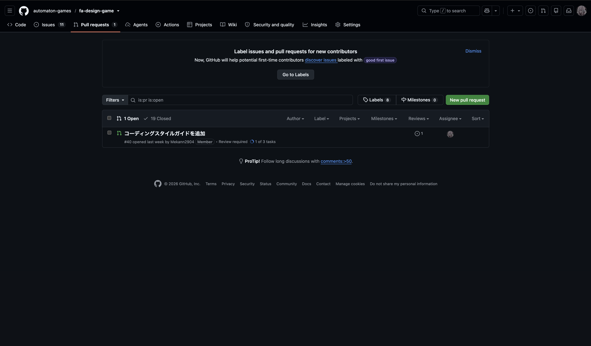
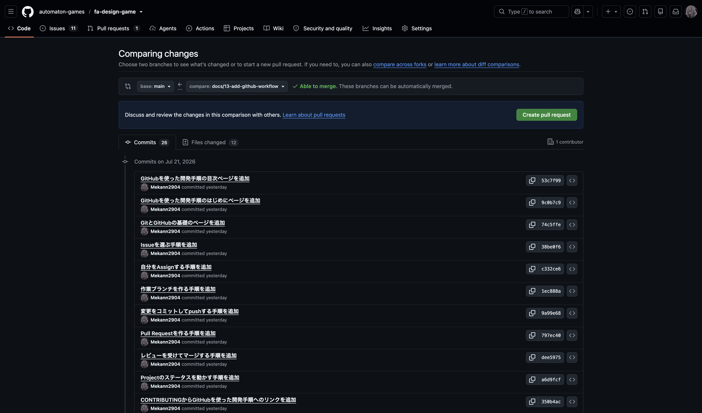
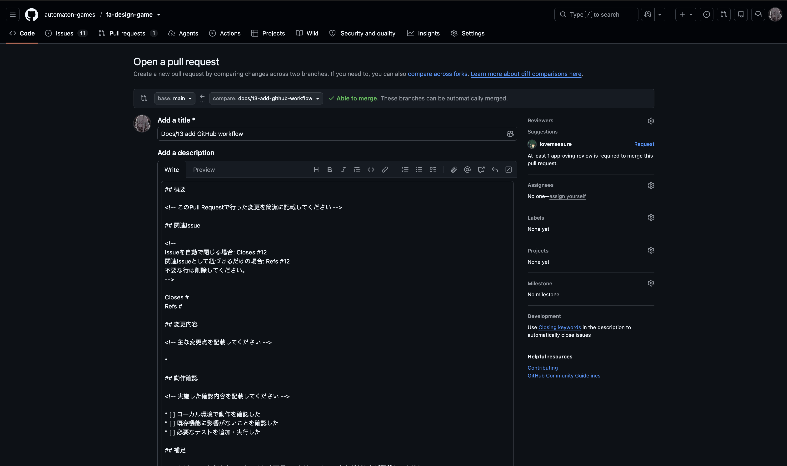

# Pull Requestを作る

> [← 目次に戻る](README.md) | [前: 07 pushする](07-push.md) | [次: 09 レビューを受けてマージする](09-review-and-merge.md)

## このページで扱うこと

**Pull Request（PR）** は、自分のブランチの変更をmainに取り込んでもらうための提案です。
このページでは、PRを作成し、Issueと紐づける手順を説明します。

## なぜPull Requestを作るのか

Pull Requestは、変更をmainに取り込む前に、ほかのメンバーに確認してもらうためのものです。
ブランチで完成させた変更も、そのままmainに入れると、見落としが混入することがあります。

Pull Requestを作ると、変更をレビューに出せます。
レビューを通った変更だけがmainに取り込まれます。

## PRを作る

pushした直後、GitHubの該当ブランチの画面に `Compare & pull request` ボタンが出ます。
これを押すとPR作成画面が開きます。

ボタンが見当たらなければ、リポジトリの `Pull requests` タブから `New pull request` を選び、ブランチを指定します。

## PRの本文を書く

PR作成画面では、テンプレートが自動で入力されます。
このリポジトリのテンプレートは、次の見出しで構成されています。

- **概要**：このPRで何を変更したか
- **関連Issue**：対応するIssue番号
- **変更内容**：主な変更点
- **動作確認**：実施した確認のチェックリスト
- **補足**：レビュアーに伝えたいこと

空欄の箇所を埋めます。
テンプレートの実物は `.github/PULL_REQUEST_TEMPLATE.md` にあります。

## Issueを紐づける

**関連Issue** に、対応するIssueを書きます。

- このPRでIssueを閉じたいとき：`Closes #Issue番号`
- 関連として紐づけるだけのとき：`Refs #Issue番号`

テンプレートには両方の行があるため、使わないほうは削除します。

`Closes` を書いておくと、PRがマージされたときにIssueも自動で閉じます。
このリポジトリでは「1 Issue = 1 Pull Request」を基本にするため、多くの場合 `Closes` を使います。
紐づけの規則は [CONTRIBUTING.md の「Pull Requestの運用」](../CONTRIBUTING.md#pull-requestの運用) を参照してください。

## レビュアーを指定する

右側の `Reviewers` から、レビューを頼む人を選びます。
指定する人が分からなければ、いったんPRのコメントで相談します。

## PRを送る

本文と紐づけができたら `Create pull request` を押します。
これでPRが公開され、レビューを待つ状態になります。

## 次のステップ

PRを作ったら、レビューに対応します。
[09 レビューを受けてマージする](09-review-and-merge.md) へ進んでください。

## 関連

- [CONTRIBUTING.md - Pull Requestの運用](../CONTRIBUTING.md#pull-requestの運用)
