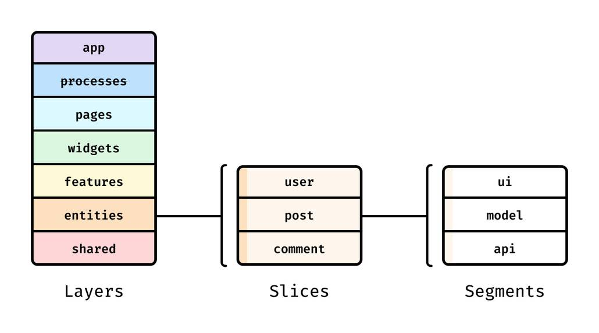

# Feature-Sliced Design（FSD）とは

フロントエンドのディレクトリ構成を決めるための方法論で、特定のフレームワークや言語に依存しません。このドキュメントは FSD そのものの解説で、**このプロジェクトで実際にどう適用しているか**は [フロントエンドのアーキテクチャ](frontend-architecture.md) を参照してください。

公式サイト: https://feature-sliced.design/

## 何を解決するのか

規模が大きくなったフロントエンドでは、次のような状態になりがちです。

- `components/` に何十個ものファイルが並び、どれがどこで使われているか分からない
- ある画面用に作った部品を別の画面から参照し、さらにその逆も起きて、依存が循環する
- 「これは共通部品か、画面固有か」の判断が人によってぶれる
- 1つの機能を直すために、離れた5つのディレクトリを触ることになる

FSD は **「置き場所のルール」と「依存の向きのルール」をセットで決める**ことでこれを防ぎます。ファイルを種類（components / hooks / utils）で分けるのではなく、**役割の抽象度**で分けるのが特徴です。

## 3つの階層



レイヤー、スライス、セグメントの関係を示した構成図。

FSD の構成は3段階です。上から順に、レイヤー → スライス → セグメントと細かくなります。

```
src/
└── widgets/                 ← レイヤー（Layer）：抽象度
    └── contest-list/        ← スライス（Slice）：何についてのコードか
        ├── index.ts
        └── ui/              ← セグメント（Segment）：技術的な役割
            └── ContestList.tsx
```

### 1. レイヤーは抽象度で分ける

レイヤーの名前と数は FSD が定めており、増やしたり名前を変えたりはしません。


`src/` 直下に並ぶレイヤーフォルダ。非推奨の `processes` は薄く表示される。

| レイヤー | 役割 | 例 |
| --- | --- | --- |
| `app` | アプリ全体の設定。ルーティング、Provider、グローバルCSS | エントリポイント、テーマ設定 |
| `pages` | 1つの画面まるごと | トップページ、記事詳細ページ |
| `widgets` | 画面を構成する大きな独立したUIブロック | ヘッダー、サイドバー、記事一覧 |
| `features` | ユーザーの操作単位の機能 | ログインする、いいねを押す、検索する |
| `entities` | ビジネス上の対象物 | ユーザー、記事、商品 |
| `shared` | 業務知識を持たない汎用部品 | ボタン、入力欄、日付フォーマット関数 |

「ユーザー」という対象物が `entities/user`、「ログインする」という操作が `features/auth`、「ヘッダー（その中にログインボタンが入る）」が `widgets/header` という関係です。

> 旧仕様には `pages` と `widgets` の間に `processes` レイヤーがありましたが、現在は非推奨です。新規に作る必要はありません。

### 2. スライスは対象で分ける

レイヤーの中を、扱う対象ごとに分けます。スライスの名前は自由で、プロダクトの言葉をそのまま使います（`contest`、`ranking-board` など）。

`app` と `shared` にはスライスがありません。この2つは「アプリ全体」「汎用」であって、特定の対象を持たないためです。

### 3. セグメントは技術的な役割で分ける

スライスの中を、役割ごとに分けます。名前は慣習でおおむね決まっています。

| セグメント | 中身 |
| --- | --- |
| `ui/` | 見た目。コンポーネント、スタイル |
| `model/` | 型、状態、ビジネスロジック |
| `api/` | サーバーとの通信 |
| `lib/` | そのスライス専用のユーティリティ |
| `config/` | 定数、設定値 |

必要なものだけ作ります。型しか持たないスライスなら `model/` だけで構いません。

## 2つのルール

FSD の実質はこの2つです。

### ルール1: 依存は下向きのみ

**上のレイヤーは下のレイヤーだけを import できます。**

```
app  →  pages  →  widgets  →  features  →  entities  →  shared
```

- OK: `widgets/header` が `shared/ui/button` を使う
- NG: `shared/ui/button` が `widgets/header` を使う（逆向き）
- NG: `widgets/header` が `widgets/footer` を使う（同じレイヤー内）

同じレイヤー内での相互 import が禁止なのが要点です。これがあるおかげで、循環依存が構造的に起きません。widget 同士で共通化したいものが出てきたら、下のレイヤーに下ろします。


依存が循環すると、1箇所の修正が離れた箇所を壊す。FSD はレイヤーの上下関係でこの状態を防ぐ。

### ルール2: スライスは公開API経由で使う

各スライスは `index.ts` で「外から使ってよいもの」だけを公開し、**中のファイルは直接 import しません。**

```ts
// OK
import { ContestList } from "@/widgets/contest-list";

// NG: 内部構造に依存してしまう
import ContestList from "@/widgets/contest-list/ui/ContestList";
```

内部のファイル構成を変えても、外側を直さずに済むようにするためです。

## よくある疑問

**features と widgets はどう違う？**
`features` はユーザーが行う操作（検索する、提出する）をまとめ、`widgets` は画面を構成する大きな独立したUIブロック（検索バー、提出フォーム一式）をまとめます。`widgets` は、複数ページで再利用するときか、1ページの中で大きな独立ブロックとして切り出せるときに作ります。判断に迷うなら、動詞で言えるものが `features`、名詞で言えるものが `widgets` と考えると分けやすくなります。

**entities に何を入れる？**
その対象に固有の**ビジネスロジック**と、対象そのものを表示する小さなコンポーネント（ユーザーのアバターなど）です。「どの画面で使うか」に依存しないものだけを入れます。

逆に、**入れてはいけないものの方が重要**です。

- **型定義だけのもの** — `type User = { id: number, name: string }` しか無いなら entity にしません
- **CRUD 処理** — 単に取得・作成・更新・削除するだけのものはビジネスロジックではないので `shared/api/` に置きます
- **認証情報** — トークンやログインユーザーの DTO は `shared/auth/` や `shared/api/` に置きます

`entities` はどこからでも参照できるため、変更の影響範囲が最も広いレイヤーです。要件が固まらないうちに作ると、後で作り直すコストが高くつきます。**まずは使う場所（page や feature の `model`）に書き、再利用が必要になってから引き上げる**のが安全です。

詳しくは公式の [Excessive Entities（エンティティの作りすぎ）](https://feature-sliced.design/docs/guides/issues/excessive-entities) を参照してください。

**全部のレイヤーを作らないといけない？**
いいえ。**該当するものが無いレイヤーは作りません。** 空のディレクトリだけあると、かえって「ここに何を入れるべきか」が分からなくなります。必要になった時点で追加します。

公式も「バックエンドに処理が寄っているアプリなら `entities` は無くてよい」と明言しています。レイヤーは埋めるためのチェックリストではありません。

**ディレクトリ名は大文字と小文字どちらで書く？**
ディレクトリは kebab-case、コンポーネントファイルは PascalCase に統一します（`shared/ui/button/Button.tsx`）。混在させると、import パスの大文字小文字を間違えても macOS では気づけず、区別する Linux（Docker、CI）で初めて壊れます。また大文字小文字だけのリネームは macOS 上では `git mv` が効かず、後から直すのが厄介です。

**小規模なプロジェクトでも使うべき？**
ファイル数が確実に増えるので、画面が数枚しかないうちは過剰になりがちです。ただし後から移行するほどコストが上がるため、**これから画面が増えることが分かっている段階で入れる**のが一番安く済みます。

**Atomic Design とどう違う？**
Atomic Design は、UI を原子（atom）→ 分子（molecule）→ 有機体（organism）→ テンプレート → ページと、小さい部品から組み上げる設計手法です。関心は「見た目の部品をどう分割し再利用するか」にあり、デザインシステムの構築に向いています。

Feature-Sliced Design の関心は「コードをビジネス上の機能と依存の向きでどう分けるか」です。関心が違うため両者は対立せず、Atomic Design でコンポーネントの粒度を決めつつ、アプリ全体の構成は FSD でまとめる、といった共存が可能です。

## メリットとデメリット

| 種別 | 内容 |
| --- | --- |
| メリット | 置き場所の判断基準が明文化され、人によってぶれない |
| メリット | 依存が一方向なので、変更の影響範囲を追いやすい |
| メリット | 機能単位でまとまるので、削除するときに消し忘れが出にくい |
| デメリット | `index.ts` の分だけファイル数が増える |
| デメリット | レイヤーの使い分け（特に features と widgets）に慣れが要る |
| デメリット | ルールを守らせる仕組みが無いと、時間とともに崩れる |

## 参考

- [公式サイト](https://feature-sliced.design/)（英語・ロシア語）
- [Overview](https://feature-sliced.design/docs/get-started/overview) — まず読むならここ
- [Layers](https://feature-sliced.design/docs/reference/layers) — 各レイヤーの詳しい定義
- [Excessive Entities](https://feature-sliced.design/docs/guides/issues/excessive-entities) — レイヤーを分けすぎないための指針
- [steiger](https://github.com/feature-sliced/steiger) — レイヤー違反を検出する公式リンター
- 構成図・フォルダ図・循環依存図は [feature-sliced/documentation](https://github.com/feature-sliced/documentation) のアセットを使用（MIT License）
