# MVP実装計画

## 目的

このドキュメントは、FA Design GameのMVPに必要なIssueと技術的な依存関係を整理し、次に着手できる作業と並行して進められる作業を明確にするためのものです。

実装状況、担当者、優先度はGitHub Projectsで管理します。このドキュメントでは、MVPの対象範囲、Issue間の依存関係、実装順序とその理由を扱います。

未作成のIssueには、このドキュメント内だけで使用する `NEW-*` 形式の仮IDを付けています。Issueを作成した後、実際のIssue番号に置き換えます。

## MVPの対象範囲

### 実現する体験

ユーザーがPracticeコンテストの問題文を読み、画面上のフォームでDFAを組み立てて提出し、AcceptedまたはWrong Answerと反例を確認できるようにします。

### Practice問題

MVPでは、次の2問を実装します。

| 問題コード | 問題 |
|---|---|
| A | 文字列長が偶数 |
| B | `1` の個数が3の倍数 |

2問用意することで、問題Aだけに依存した実装ではなく、問題コードによって公開データと判定用DFAを切り替えられることを確認します。問題C以降はMVP後に追加します。

### DFA入力

ユーザーに生のJSONを直接入力させず、次の項目を持つDFA入力フォームを提供します。

- 状態の追加、削除、名前入力
- 問題で指定されたアルファベットの表示
- 開始状態の選択
- 受理状態の選択
- 状態と入力記号ごとの遷移先選択

Frontendはフォームの内容からDFA JSONを生成し、Backendへ送信します。BackendはFrontendを信頼せず、受信したDFA JSONを再度検証します。

### ページ

MVPでは、`docs/pages.md` に記載されている次の6ページを対象にします。

- トップページ
- チュートリアルページ
- コンテスト一覧ページ
- Practiceコンテストページ
- 問題一覧ページ
- 問題詳細・提出ページ

ただし、サイトの根幹である「問題表示、DFA入力、提出、判定」を先に縦方向に完成させます。トップページやチュートリアルページは、その後に整備します。

### 公開識別子

公開識別子は次の名前で扱う方針とします。詳細は [#49](https://github.com/automaton-games/fa-design-game/issues/49) で確定し、仕様書と関連Issueへ反映します。

- コンテストのURL用識別子: `slug`
- コンテスト内の問題識別子: `code`
- 将来DBを導入した場合の内部主キー: `id`

MVPで使用するURL自体は変わりません。

```text
/api/contests/practice/tasks/A
/api/contests/practice/tasks/B
```

## 完了済みの基盤

| Issue | 内容 | 状態 |
|---|---|---|
| [#14](https://github.com/automaton-games/fa-design-game/issues/14) | Backendの `/health` API | 完了 |
| [#15](https://github.com/automaton-games/fa-design-game/issues/15) | React Frontendの初期構成 | 完了 |
| [#18](https://github.com/automaton-games/fa-design-game/issues/18) | Docker Compose開発環境 | 完了 |
| [#20](https://github.com/automaton-games/fa-design-game/issues/20) | DFA JSON用Go構造体 | 完了 |
| [#21](https://github.com/automaton-games/fa-design-game/issues/21) | Gin導入 | 完了 |
| [#50](https://github.com/automaton-games/fa-design-game/issues/50) | health実装の整理 | 完了 |

## 既存Issueの整理

| Issue | MVPでの役割 | 対応方針 |
|---|---|---|
| [#22](https://github.com/automaton-games/fa-design-game/issues/22) | DFA妥当性検証 | 継続。Issue上の進捗とGitHubの `main` に差があるため、現在の作業場所を確認する |
| [#36](https://github.com/automaton-games/fa-design-game/issues/36) | トップページ | 継続。共通ヘッダーとフッターは `NEW-FE-ROUTER` 側で扱うよう調整する |
| [#44](https://github.com/automaton-games/fa-design-game/issues/44) | Frontend CI | 継続。`pnpm lint` と `pnpm build` の両方を実行する |
| [#45](https://github.com/automaton-games/fa-design-game/issues/45) | コンテスト一覧API | 継続。自動テストを完了条件へ追加し、#46と#49の後に実装する |
| [#46](https://github.com/automaton-games/fa-design-game/issues/46) | Backendルーター分離とhealthテスト | 内容を調整し、#45より先に実装する |
| [#48](https://github.com/automaton-games/fa-design-game/issues/48) | Practice問題の公開データ | 対象を問題A・Bへ変更し、問題CはMVP後とする |
| [#49](https://github.com/automaton-games/fa-design-game/issues/49) | `slug` と `code` の仕様確定 | API、データ、Frontendルーティングより先に確定する |

次のIssueはMVPの提出フローを直接ブロックしないため、別の開発作業として扱います。

- [#13](https://github.com/automaton-games/fa-design-game/issues/13): GitHub初心者向け開発手順
- [#39](https://github.com/automaton-games/fa-design-game/issues/39): コーディングスタイルガイド
- [#43](https://github.com/automaton-games/fa-design-game/issues/43): ドキュメント構成整理

## 新しく作成するIssue案

### 仕様

| 仮ID | Issue案 | 主な完了条件 |
|---|---|---|
| `NEW-SPEC` | `docs: MVPのDFA入力・提出API仕様を確定する` | DFA入力フォーム、DFA JSON制約、Accepted、Wrong Answer、反例、入力エラー、HTTPステータスが定義されている |

### Backend

| 仮ID | Issue案 | 主な完了条件 |
|---|---|---|
| `NEW-BE-EQUIV` | `backend: DFAの等価性を判定して最短反例を返す` | 等価なDFAを判定でき、不等価な場合は最短反例を返せる |
| `NEW-BE-JUDGE-DATA` | `backend: Practice問題A・Bの判定用DFAを定義する` | 問題コードから判定用DFAを取得でき、公開APIには含まれない |
| `NEW-BE-PRACTICE-API` | `backend: Practiceコンテスト詳細APIを実装する` | Practiceコンテストの概要を取得できる |
| `NEW-BE-TASKS-API` | `backend: Practice問題一覧APIを実装する` | 問題A・Bの一覧を取得できる |
| `NEW-BE-TASK-API` | `backend: Practice問題詳細APIを実装する` | 問題コードを指定して問題文とアルファベットを取得できる |
| `NEW-BE-SUBMIT-API` | `backend: Practice問題の提出APIを実装する` | 問題A・BへDFAを提出でき、Accepted、Wrong Answer、反例、入力エラーを返せる |
| `NEW-CI-BACKEND` | `ci: GoのテストをGitHub Actionsで実行する` | Pull Requestで `go test ./...` が自動実行される |

任意の文字列を入力してDFAを実行するユーザー向け機能はMVP対象外です。等価性判定に必要な遷移処理は、`NEW-BE-EQUIV` の内部実装として扱います。

### Frontend

| 仮ID | Issue案 | 主な完了条件 |
|---|---|---|
| `NEW-FE-ROUTER` | `frontend: React Routerと共通レイアウトを導入する` | 6ページのルート、共通ヘッダー、フッター、404表示がある |
| `NEW-FE-CLIENT` | `frontend: APIクライアントと開発時接続設定を追加する` | Backend APIを型付きで呼び出せ、開発環境から接続できる |
| `NEW-FE-TUTORIAL` | `frontend: チュートリアルページを実装する` | DFA入力と判定結果の基本を確認できる |
| `NEW-FE-CONTESTS` | `frontend: コンテスト一覧ページを実装する` | APIからPracticeコンテストを取得して表示できる |
| `NEW-FE-PRACTICE` | `frontend: Practiceコンテスト概要ページを実装する` | Practiceの概要と問題一覧へのリンクを表示できる |
| `NEW-FE-TASKS` | `frontend: Practice問題一覧ページを実装する` | 問題A・Bを表示し、問題詳細へ移動できる |
| `NEW-FE-TASK` | `frontend: 問題詳細ページを実装する` | 問題文、問題コード、アルファベットを表示できる |
| `NEW-FE-EDITOR` | `frontend: DFA入力フォームを実装して提出用JSONを生成する` | 状態、開始状態、受理状態、遷移を入力し、DFA JSONを生成できる |
| `NEW-FE-SUBMIT` | `frontend: DFAを提出して判定結果と反例を表示する` | 提出中、Accepted、Wrong Answer、反例、入力エラー、通信エラーを表示できる |

### 結合テスト

| 仮ID | Issue案 | 主な完了条件 |
|---|---|---|
| `NEW-TEST-SUBMIT` | `test: Practice問題A・Bの提出APIを結合テストする` | AのAccepted・Wrong Answer・反例と、BのAcceptedをAPI全体で確認できる |

## Issueの依存関係

```mermaid
flowchart TB
    subgraph DOCS["仕様"]
        ISSUE37["#37 MVP実装計画"]
        ISSUE49["#49 slug・code仕様"]
        SPEC["NEW-SPEC<br/>DFA入力・提出API仕様"]
        ISSUE37 --> ISSUE49
        ISSUE49 --> SPEC
    end

    subgraph FOUNDATION["完了済みの基盤"]
        HEALTH["#14 /health"]
        REACT["#15 React初期構成"]
        DFA_TYPE["#20 DFA構造体"]
    end

    subgraph BACKEND["Backend"]
        ROUTER["#46 ルーター分離・healthテスト"]
        VALIDATE["#22 DFA妥当性検証"]
        EQUIV["NEW-BE-EQUIV<br/>等価性判定・最短反例"]
        PUBLIC_DATA["#48 問題A・B公開データ"]
        JUDGE_DATA["NEW-BE-JUDGE-DATA<br/>問題A・B判定用DFA"]
        CONTESTS_API["#45 コンテスト一覧API"]
        PRACTICE_API["NEW-BE-PRACTICE-API"]
        TASKS_API["NEW-BE-TASKS-API"]
        TASK_API["NEW-BE-TASK-API"]
        SUBMIT_API["NEW-BE-SUBMIT-API"]

        HEALTH --> ROUTER
        DFA_TYPE --> VALIDATE
        SPEC --> VALIDATE
        VALIDATE --> EQUIV
        SPEC --> PUBLIC_DATA
        ISSUE49 --> PUBLIC_DATA
        ISSUE49 --> CONTESTS_API
        PUBLIC_DATA --> JUDGE_DATA

        ROUTER --> CONTESTS_API
        ROUTER --> PRACTICE_API
        ROUTER --> TASKS_API
        ROUTER --> TASK_API
        ROUTER --> SUBMIT_API
        PUBLIC_DATA --> TASKS_API
        PUBLIC_DATA --> TASK_API
        VALIDATE --> SUBMIT_API
        EQUIV --> SUBMIT_API
        JUDGE_DATA --> SUBMIT_API
        SPEC --> SUBMIT_API
    end

    subgraph FRONTEND["Frontend"]
        FE_ROUTER["NEW-FE-ROUTER<br/>Router・共通レイアウト"]
        FE_CLIENT["NEW-FE-CLIENT<br/>APIクライアント・接続設定"]
        TOP["#36 トップページ"]
        TUTORIAL["NEW-FE-TUTORIAL"]
        CONTESTS_PAGE["NEW-FE-CONTESTS"]
        PRACTICE_PAGE["NEW-FE-PRACTICE"]
        TASKS_PAGE["NEW-FE-TASKS"]
        TASK_PAGE["NEW-FE-TASK"]
        EDITOR["NEW-FE-EDITOR<br/>DFA入力フォーム"]
        SUBMIT_UI["NEW-FE-SUBMIT<br/>提出・結果・反例"]

        REACT --> FE_ROUTER
        REACT --> FE_CLIENT
        ISSUE49 --> FE_ROUTER
        SPEC --> FE_CLIENT
        FE_ROUTER --> TOP
        FE_ROUTER --> TUTORIAL
        CONTESTS_API --> CONTESTS_PAGE
        PRACTICE_API --> PRACTICE_PAGE
        TASKS_API --> TASKS_PAGE
        TASK_API --> TASK_PAGE
        FE_CLIENT --> CONTESTS_PAGE
        FE_CLIENT --> PRACTICE_PAGE
        FE_CLIENT --> TASKS_PAGE
        FE_CLIENT --> TASK_PAGE
        FE_ROUTER --> CONTESTS_PAGE
        FE_ROUTER --> PRACTICE_PAGE
        FE_ROUTER --> TASKS_PAGE
        FE_ROUTER --> TASK_PAGE
        TASK_PAGE --> EDITOR
        SPEC --> EDITOR
        EDITOR --> SUBMIT_UI
        FE_CLIENT --> SUBMIT_UI
        SUBMIT_API --> SUBMIT_UI
    end

    subgraph QUALITY["テスト・品質"]
        FRONTEND_CI["#44 Frontend CI"]
        BACKEND_CI["NEW-CI-BACKEND"]
        SUBMIT_TEST["NEW-TEST-SUBMIT<br/>A・B提出API結合テスト"]

        REACT --> FRONTEND_CI
        DFA_TYPE --> BACKEND_CI
        SUBMIT_API --> SUBMIT_TEST
    end
```



## 実装順序

### Phase 0: 仕様とテスト基盤

1. #22の現在の作業状況を確認する
2. #49で `slug` と `code` の方針を確定する
3. `NEW-SPEC` でDFA入力と提出APIの仕様を確定する
4. #46をルーター分離とhealthテストへ整理する
5. #44と `NEW-CI-BACKEND` でCIを整備する

仕様作業、Backendルーター分離、Frontend CI、Backend CIは並行できます。

### Phase 1: 判定エンジン

1. #22のDFA妥当性検証を完了する
2. #48で問題A・Bの公開データを定義する
3. `NEW-BE-EQUIV` で等価性判定と最短反例を実装する
4. `NEW-BE-JUDGE-DATA` で問題A・Bの判定用DFAを定義する

等価性判定と問題データ作成は、DFA JSON仕様の確定後に並行できます。

### Phase 2: 提出フローを縦に完成させる

1. `NEW-BE-TASK-API` で問題詳細を取得できるようにする
2. `NEW-BE-SUBMIT-API` で問題A・Bを判定できるようにする
3. `NEW-FE-ROUTER` と `NEW-FE-CLIENT` を実装する
4. `NEW-FE-TASK` で問題詳細を表示する
5. `NEW-FE-EDITOR` でDFAを入力できるようにする
6. `NEW-FE-SUBMIT` で提出結果と反例を表示する
7. `NEW-TEST-SUBMIT` でA・Bの提出APIを結合テストする

このPhaseの完了時点で、問題詳細ページへ直接アクセスすれば、MVPの根幹である提出と判定を一通り体験できます。

### Phase 3: 閲覧導線を完成させる

1. #45と `NEW-FE-CONTESTS` でコンテスト一覧を実装する
2. `NEW-BE-PRACTICE-API` と `NEW-FE-PRACTICE` でPractice概要を実装する
3. `NEW-BE-TASKS-API` と `NEW-FE-TASKS` で問題一覧を実装する
4. #36でトップページを実装する
5. `NEW-FE-TUTORIAL` でチュートリアルページを実装する

各Backend APIが完成したものから、対応するFrontendページを並行して実装できます。

## MVPの完了条件

- ローカル環境でFrontendとBackendを起動できる
- 6ページを移動でき、存在しないページでは404が表示される
- Practice問題A・Bの一覧と問題文を表示できる
- DFA入力フォームから提出用JSONを生成できる
- 問題A・BへDFAを提出できる
- 正しいDFAに対してAcceptedが表示される
- 誤ったDFAに対してWrong Answerと反例が表示される
- 不正なDFAに対して入力エラーが表示される
- BackendのGoテスト、FrontendのlintとbuildがCIで成功する
- 問題AのAccepted・Wrong Answerと問題BのAcceptedが結合テストで確認される

## Issue作成後の更新手順

1. このドキュメントの `NEW-*` を実際のIssue番号へ置き換える
2. GitHubのRelationshipsで `blocked by` と `blocking` を設定する
3. 作成したIssueをGitHub Projectsへ追加する
4. 実装状況と担当者はProjectsで更新し、このドキュメントでは重複管理しない
