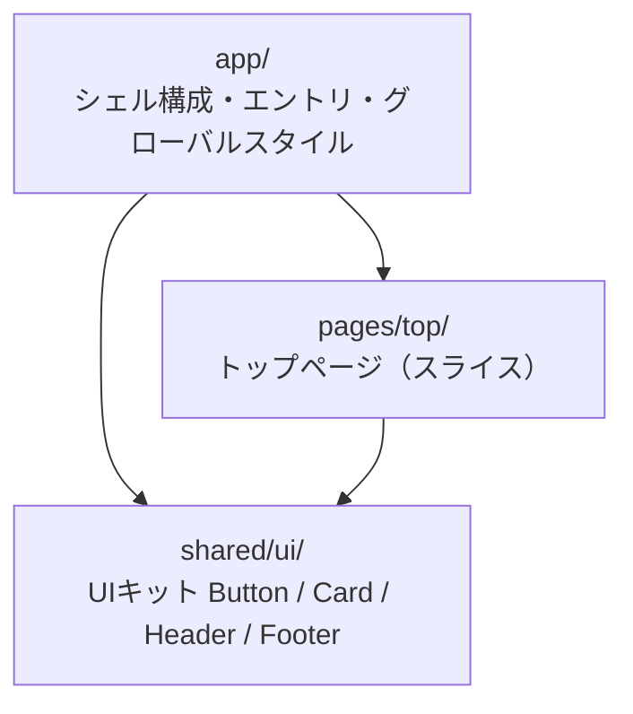
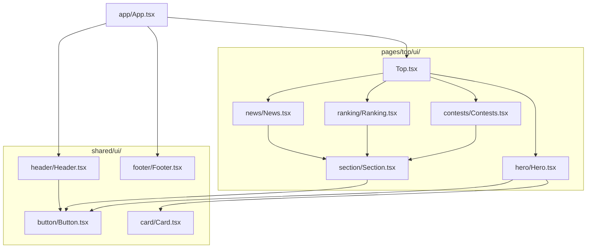

# refactor/59-top-page-cleanup のレビュー・議論用ドキュメント

> ブランチ [`refactor/59-top-page-cleanup`](https://github.com/automaton-games/fa-design-game/tree/refactor/59-top-page-cleanup) ／ 関連 Issue: [#59 Feature/36 create top page](https://github.com/automaton-games/fa-design-game/issues/59)
>
> このドキュメントは、本ブランチの **Feature-Sliced Design (FSD) 移行** を、レビュー・議論しやすくするためにまとめたものです。PR 説明文のベースとしても使えます。

## 1. 目的と背景

トップページ（[#36](https://github.com/automaton-games/fa-design-game/issues/36) / [#59](https://github.com/automaton-games/fa-design-game/issues/59)）の実装が一段落したタイミングで、コード構造を **Feature-Sliced Design（FSD）** の公式仕様に合わせて整理しました。あわせて FSD 公式アーキテクチャリンター **[Steiger](https://github.com/feature-sliced/steiger)** を導入し、構造ルールを機械的に検証できるようにしています。

**やったこと（3点）**

1. **FSD 構造への移行**：`app / pages / shared` の3層 + public API（barrel `index.ts`）+ `@/` エイリアス
2. **Steiger の導入**：`recommended` 設定で構造をリント（CI 組み込みも視野）
3. **おもなリファクタリング**：セクション外枠の `<Section>` コンポーネント化、見出しの `<h3>` セマンティクス化、`Contest.level` の union 型化（詳細は §5）

外部の動作（見た目、機能）は **トップページの仕様を一切変えず**、構造と型安全性だけを改善しています（※見出しの `<h3>` 化に伴いカードタイトルが太字になる件のみ、意図的な視覚変化。詳細は §5）。

## 2. 構造の変化（Before → After）

### Before（移行前）

```
src/
├─ App.tsx
├─ main.tsx
├─ index.css
├─ components/            ← 役割別バラバラ
│  ├─ Button/ Card/ Header/ Footer/
└─ features/top/
   ├─ components/         ← Hero/Contests/Ranking/News + Section.css
   └─ pages/Top.{tsx,css}
```

### After（移行後：FSD）

```
src/
├─ app/                          # App 層：アプリ全体の初期化・シェル
│  ├─ App.tsx                    #   Header / main / Footer のシェル構成
│  ├─ main.tsx                   #   エントリポイント
│  └─ styles/{index.css,app.css} #   グローバルスタイル・デザイントークン
├─ pages/                        # Pages 層
│  └─ top/                       #   スライス（ページ1つ = スライス1つ）
│     ├─ index.ts                #   public API（barrel）
│     └─ ui/
│        ├─ Top.{tsx,css}        #     ページ本体
│        ├─ section/             #     ※ページ内でのみ再利用するセクション外枠
│        ├─ hero/ contests/ ranking/ news/
├─ shared/                       # Shared 層
│  └─ ui/                        #   UIキット（ビジネスロジックなし）
│     ├─ index.ts                #   public API（barrel）
│     ├─ button/ card/
│     └─ header/ footer/         #   全ページ共通のシェル部品
└─ (steiger.config.ts)           # FSD 公式リンター設定（src と同階層）
```

移行に伴い `src/components/`・`src/features/`・`src/App.tsx`・`src/main.tsx`・`src/index.css` は削除し、上記へ集約・再配置しています。

### 依存関係（FSD の import 規則）

FSD の絶対ルールは **「上位層 → 下位層のみ参照（import）可能」** です。本プロジェクトの層間依存は以下のとおり一方向で、逆方向の import は Steiger が機械的に弾きます。



モジュール単位の依存は以下のとおりです（矢印 = import 元）。ページ内ブロック（hero / contests / ranking / news / section）はすべて `pages/top/ui/` 内に閉じ、`shared/ui` だけを参照しています。



## 3. アーキテクチャ決定と根拠

各判断は [FSD 公式ドキュメント](https://feature-sliced.design/) に照らして行いました。主要なものを整理します。

| # | 決定 | 根拠（FSD 公式） |
| --- | --- | --- |
| 1 | **レイヤーは `app/pages/shared` のみ**（features/widgets/entities は作らない） | Overview「Typically, most frontend projects will have at least the Shared, Pages, and App layers」「You don't have to use every layer」 |
| 2 | **`entities` 層を意図的に作らない**（Contest/User/NewsItem 型は page 内に留める） | Excessive Entities §0「it is completely fine for the application to have no `entities` layer. It doesn't break FSD in any way」／§1「Avoid preemptive slicing … the later you move code, the less dangerous」 |
| 3 | **`widgets/` を `pages/top/ui/` に統合**（Steiger `insignificant-slice` 解消） | Migration v2.1「`insignificant-slice` … will suggest merging into the page entirely」＋ Pages「If a UI block on a page is not reused, it's perfectly fine to keep it inside the page slice」 |
| 4 | **`<Section>` を `pages/top/ui/section/` に配置**（shared/widget にしない） | Widgets「If a block of UI … is never reused, it **should not be a widget**, and instead placed directly inside that page」 |
| 5 | **app シェル（Header/main/Footer）を `app/App.tsx` へ移動** | Page Layouts「Move the layout to the App layer」「Write the layout inline on the App layer, where you configure the routing」 |
| 6 | **Header.tsx は Button を `../button/Button`（相対）で import** | Public API「When they are in the same slice, always use **relative** imports」（barrel 自己 import による循環依存を防ぐ公式原則） |
| 7 | **`@/` エイリアスを `baseUrl` 無しの `paths` で設定** | TS6.0 で `baseUrl` が非推奨のため。各 FW ガイドも `"@/*": ["./src/*"]` を推奨 |
| 8 | **ディレクトリは kebab-case、コンポーネントファイルは PascalCase** | FSD 公式例は一貫して kebab-case（`pages/feed/`, `shared/ui/button/`）。加えて `design-system.md` 記載の「import 大文字小文字不一致で Docker/CI ビルド崩壊」リスクを、ディレクトリを小文字化して排除 |

> ※命名規則は kebab-case（ディレクトリ）に決定し、本ブランチで適用済みです。

## 4. Steiger による機械的検証

[Steiger](https://github.com/feature-sliced/steiger) は FSD 公式のアーキテクチャリンターです。本ブランチでは `recommended` 設定を **オーバーライドなし** で採用し、以下のルールを機械的に強制しています。

- `fsd.public-api`：public API（barrel）経由の import の強制
- `fsd.forbidden-imports`：レイヤー間 import 規則（上位層 → 下位層のみ）
- `fsd.no-segmentless-slices`：スライス直下のファイル散らばり禁止
- `fsd.insignificant-slice`：1箇所でしか使われないスライスの検出
- `fsd.excessive-slicing`：過剰分割の検出

```bash
$ pnpm steiger
✔ No problems found!
```

**設定（`steiger.config.ts`）**

```ts
import { defineConfig } from 'steiger'
import fsd from '@feature-sliced/steiger-plugin'

export default defineConfig([
  ...fsd.configs.recommended,
])
```

CI への組み込み（`pnpm steiger` を GitHub Actions に追加）は、この PR のスコープ外としました（別 issue で扱う想定）。

## 5. おもなリファクタリング

構造整理とあわせて、以下のリファクタリングを行いました（動作は変えません）。

| 変更 | 内容 | 視覚影響 |
| --- | --- | --- |
| **セクション外枠のコンポーネント化** | `pages/top/ui/section/Section.tsx` を新設。Contests/Ranking/News で3重だった外枠（見出し、一覧、「もっと見る」ボタン）を `<Section title=…>{list}</Section>` に集約し、孤児だった `Section.css` もコンポーネントと同階層に配置 | **なし**（出力 DOM が同一） |
| **見出しのセマンティクス化** | Card の `.card__title` を `<p>`→`<h3>`、Footer の `.footer__heading`（3箇所）を `<p>`→`<h3>`。`design-system.md` の見出し階層規約（h1→h2→h3）に準拠 | **一部あり**（後述） |
| **`Contest.level` の型厳密化** | `level: string` → `type Level = "入門"\|"初級"\|"中級"\|"上級"`、`Record<Level,string>`、`?? ""` フォールバック削除。不正値をコンパイル時に検出 | **なし**（型のみ） |

**見出し化に伴う視覚変化**：Card の `.card__title` には `font-weight` 指定がなく、`<p>`→`<h3>` 化で h3 のデフォルト（**太字**）が適用されます。上下マージンは隣接マージン相殺で不変です。Footer は `.footer__heading` に `font-size: var(--font-md)` を追加し、見た目を完全に保持しています。

## 6. 検証結果

すべて通過済みです（コミット前に毎回確認）。

| チェック | 結果 |
| --- | --- |
| Steiger（recommended・オーバーライド0） | `✔ No problems found!` |
| build（`pnpm build`） | `✓ built`（38モジュール・JS 197.58kB） |
| ESLint（`pnpm lint`） | クリーン |
| dev サーバ（`http://localhost:5173`） | 200（Contests/Section/Card のモジュール解決確認済） |

> **kebab-case リネーム後の出力確認**：`pnpm build` の出力ハッシュが **リネーム前と完全一致**（`index-*.js` / `index-*.css` 同一）し、命名変更が機能、見た目に一切影響していないことを確認済みです。

## 7. 関連リンク

- Issue: [#59 Feature/36 create top page](https://github.com/automaton-games/fa-design-game/issues/59)
- ブランチ: [`refactor/59-top-page-cleanup`](https://github.com/automaton-games/fa-design-game/tree/refactor/59-top-page-cleanup)
- FSD 公式ドキュメント: <https://feature-sliced.design/docs/get-started/overview>
- Steiger（FSD 公式リンター）: <https://github.com/feature-sliced/steiger>
- デザインシステム（本リポジトリ）: [`docs/design-system.md`](design-system.md)

---

> ※ 本ブランチの変更はすべて **未コミット** です。レビュー・議論が固まり次第、コミット方針（新規 stacked ブランチ／現ブランチ／#59 マージ後）を決めて反映します。
