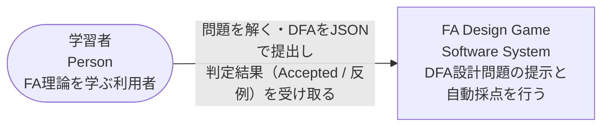
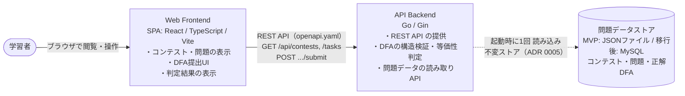

# アーキテクチャ

## 文書情報

| 項目 | 値 |
|---|---|
| 対象 | FA Design Game のシステム全体構成 |
| 記法 | [C4モデル](https://c4model.com)（L1 Context / L2 Container）を Mermaid で表現 |
| 関連 | [バックエンド システム詳細設計書](system-design.md)、[フロントエンド](frontend.md)、[openapi.yaml](openapi.yaml)、[MVP仕様](../product/mvp.md) |
| ステータス | Draft |

## C4レベルと対応ドキュメント

| レベル | 内容 | 正 |
|---|---|---|
| L1 Context | システムと利用者・外部システムの関係 | 本書 |
| L2 Container | デプロイ単位（アプリ・データストア）と技術・通信経路 | 本書 |
| L3 Component | バックエンド内部のパッケージ・層 | [system-design.md](system-design.md) 第1節 |
| L4 Code | 型・関数 | [system-design.md](system-design.md) の関数仕様（自動生成はしない） |

> L3・L4 は system-design.md が担うため本書は重複しない。本書はシステム全体像（L1/L2）のみを唯一の正として記述する。

## システムの概要

FA Design Game は、学習者がDFA（決定性有限オートマトン）を設計し、サーバーで自動判定する学習・採点システムである（[MVP仕様](../product/mvp.md)）。MVPではログイン・ユーザー管理・提出履歴を行わず、問題の閲覧・DFAの提出・即時判定結果の表示に絞る。

## L1 システムコンテキスト

システムを利用する人と外部システムとの関係。

- MVPに外部システム依存はない（認証プロバイダー・外部API・決済等を持たない）。
- L1 が単純なのはMVPのスコープを反映（単一アクター・外部依存なし）。リッチさは L2 / L3 で段階的に深掘りする。
- 将来の拡張候補（現時点では構成に含めない）: 認証プロバイダー（MVP後のログイン）、MySQL（データストア移行）、本番ホスティング。

## L2 コンテナ

システムを構成するデプロイ単位（コンテナ）・技術・通信経路。

| コンテナ | 技術 | 責務 | 備考 |
|---|---|---|---|
| Web Frontend | React / TypeScript / Vite | コンテスト・問題の表示、DFA提出UI、判定結果の表示 | 実装詳細は実装者の権限（[frontend.md](frontend.md)） |
| API Backend | Go / Gin | REST API 提供、DFAの構造検証・等価性判定、問題データの読み取りAPI | 内部構造は [system-design.md](system-design.md)（L3 相当） |
| 問題データストア | MVP: JSONファイル / 移行後: MySQL | コンテスト・問題データ（正解DFAを含む）の永続化 | loader seam で Backend に隠蔽（[ADR 0005](../adr/0005-persistence-strategy.md)） |

### 通信とデータフロー

- **学習者 ↔ Frontend**: ブラウザでSPAを閲覧・操作する。MVPはローカルHTTP。
- **Frontend ↔ Backend**: REST API（[openapi.yaml](openapi.yaml)）。読み取り（`GET /api/contests`・`/tasks`）と提出（`POST .../submit`）、稼働確認（`GET /health`）。境界は契約で定義し、消費側の視点は [frontend.md](frontend.md)。
- **Backend ↔ 問題データストア**: サーバー**起動時に1回** loader が読み込み、検証して**不変のインメモリストア**を構築する（[ADR 0005](../adr/0005-persistence-strategy.md)）。実行時にストアへ問い合わせない。

### デプロイ（dev）

Frontend（Vite :5173）と Backend（Gin :8080）は別プロセス（[docker-compose.yml](../../docker-compose.yml)）。リバースプロキシ・本番デプロイはMVPの対象外。
