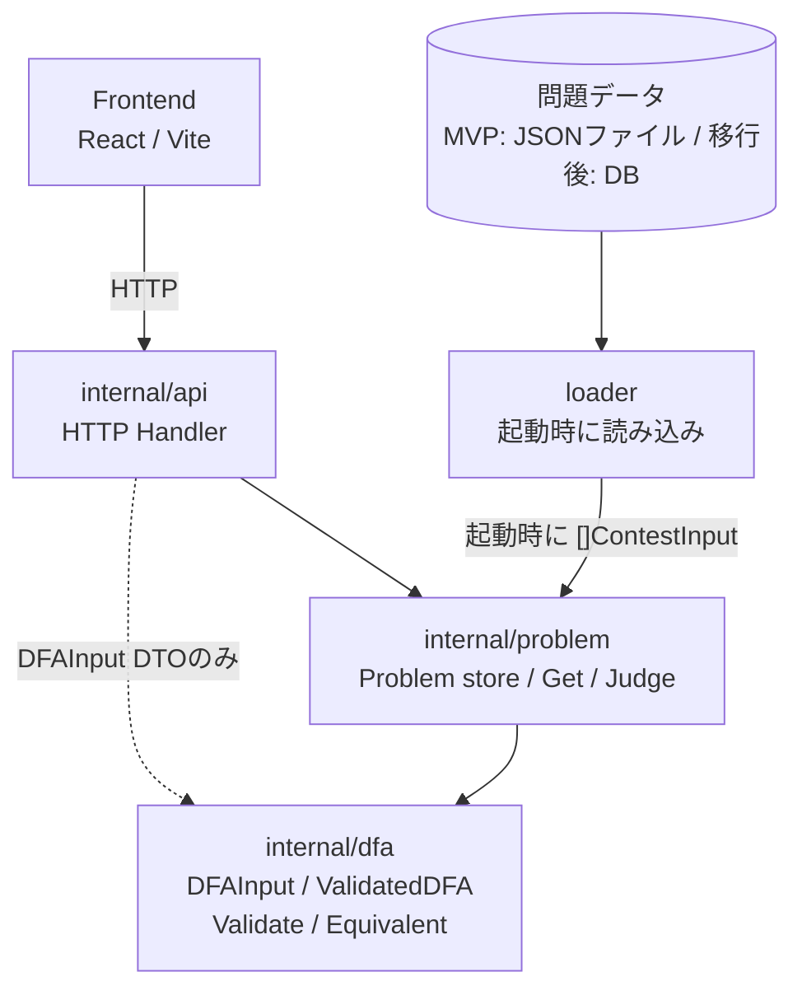
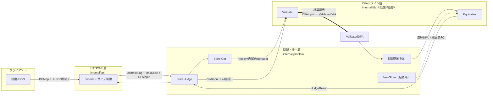
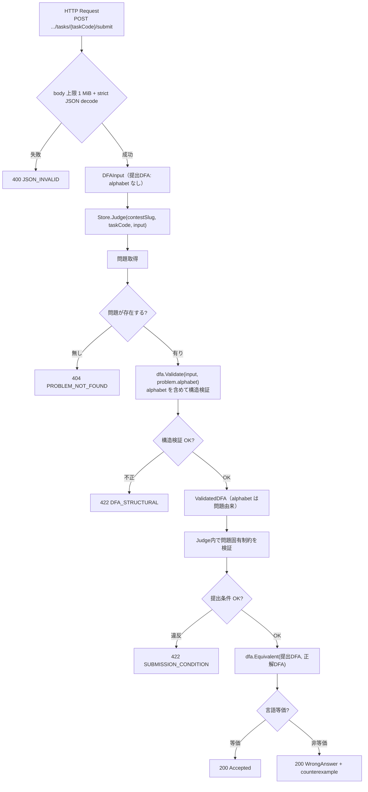
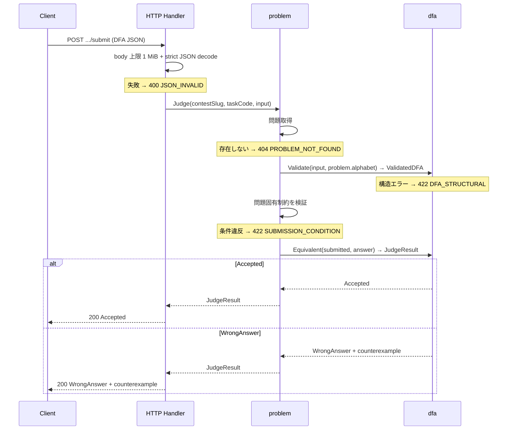

# バックエンド システム詳細設計書

## 文書情報

| 項目 | 値 |
|---|---|
| 対象 | FA Design Game バックエンド（Go / Gin）全体の詳細設計 |
| 対象Issue | [#58 DFA提出・検証・等価性判定の責務境界と処理フローを設計する](https://github.com/automaton-games/fa-design-game/issues/58) |
| 関連Issue | [#22 構造体検証](https://github.com/automaton-games/fa-design-game/issues/22)、[#54 等価性判定](https://github.com/automaton-games/fa-design-game/issues/54) |
| 関連ADR | [0001 公開識別子](../adr/0001-public-identifiers.md)、[0002 alphabetの情報源](../adr/0002-alphabet-source.md)、[0003 構造検証と提出検証の責務境界](../adr/0003-validation-boundary.md)、[0004 正解DFAのライフサイクル](../adr/0004-answer-dfa-lifecycle.md)、[0005 永続化層と起動時読み込み](../adr/0005-persistence-strategy.md) |
| 外部契約 | [openapi.yaml](openapi.yaml)（API契約）、[DFA JSON形式](dfa-json-format.md) |
| 用語集 | [CONTEXT.md](../../CONTEXT.md) |
| バージョン | 1.0 |
| ステータス | Draft |
| 作成日 | 2026-08-03 |

> 本書はバックエンドの**内部設計**を唯一の正として記述する。HTTPの外部契約とDFAの構造スキーマは [openapi.yaml](openapi.yaml)、DFAの制約・入力要件は [DFA JSON形式](dfa-json-format.md) をそれぞれの正とし、本書はそれらを参照して重複しない（SSOT）。

---

## 1. システム概要

### 1.1 全体構成



問題データは永続化層の loader が起動時に読み込み、`[]ContestInput` を `problem.NewStore` へ渡す（[ADR 0005](../adr/0005-persistence-strategy.md)）。MVP では JSON ファイル、DB 移行後は SQL/GORM から読み、ドメイン層は永続化手法を知らない。問題データの格納方法は MVP の対象外（[MVP仕様](../product/mvp.md)）。

### 1.2 パッケージと層の責務

| 層 | package | 責務 |
|---|---|---|
| HTTP/API層 | `internal/api`（仮） | ルーティング、JSONのdecode/encode、`Store.Judge`の呼び出し、エラーからHTTP status/レスポンスへの変換 |
| 問題・提出層 | `internal/problem`（仮） | `Problem`、問題データの検証（検証済みで保持）、`Get`、提出パイプラインのオーケストレーション（`Judge`）と問題固有制約 |
| 永続化層 | `internal/problem/data`（仮） | 問題データの読み込みと `[]ContestInput` の構築。MVP は JSON ファイル、DB 移行後は SQL/GORM。ドメイン層・API は永続化手法を知らない |
| DFAドメイン層 | `internal/dfa` | `DFAInput`、非公開フィールドを持つ`ValidatedDFA`、構造検証（`Validate`）、等価性判定（`Equivalent`）、HTTP非依存のtyped error。問題に依存しない |

振る舞いの依存方向は`api → problem → dfa`とし、`api → dfa`はdecodeに使う`DFAInput` DTOへの型参照だけに限定する。`dfa`は葉であり循環しない。構造検証と等価性判定は`internal/dfa`に同居させる。application/service層は増やさず、問題・提出層の`Store.Judge`を提出ユースケースの単一の入口とする。HTTP handlerはDFAの検証順序、問題の入力アルファベット、正解DFAを知らない。永続化層（`problem/data`）は起動時に1度だけ loader を実行して `[]ContestInput` を `NewStore` へ渡し、実行時の依存を持たない（[ADR 0005](../adr/0005-persistence-strategy.md)）。

### 1.3 起動と問題データの読み込み

起動時に永続化層の loader が問題データを読み込み、`problem.NewStore(load)` が検証して不変ストアを構築し、HTTP handler へ注入する（DI）（[ADR 0005](../adr/0005-persistence-strategy.md)）。各問題の正解DFAを読み込み時に構造検証して `ValidatedDFA` として保持する（[ADR 0004](../adr/0004-answer-dfa-lifecycle.md)）。読み込み時の検証失敗は問題データ不良であり、サーバーを起動せず fail-fast で起動を中止する。提出ごとに正解DFAを再検証しない。読み込みとストアの詳細は第3節に示す。

### 1.4 責務境界

提出は4つの責務ゾーン（クライアント／HTTP/API層／問題・提出層／DFAドメイン層）を横断し、ゾーンの境界を越えるデータと契約を矢印に示す。とくに **`DFAInput → ValidatedDFA` の型境界（太線）は非公開フィールドと`Validate`に限定した構築で表現し、未検証入力を通常の呼び出し経路から等価性判定へ渡さない**（第2.2節、[ADR 0003](../adr/0003-validation-boundary.md)）。alphabet は問題データを唯一の情報源とし `Validate` 内で注入され（[ADR 0002](../adr/0002-alphabet-source.md)）、正解DFAは起動時に `NewStore` で検証済みの `ValidatedDFA` として保持される（[ADR 0004](../adr/0004-answer-dfa-lifecycle.md)）。エラーとHTTPステータスの対応は第2.1節の表に示す。



---

## 2. 共通設計

### 2.1 エラー分類とHTTPステータス

HTTPステータスとエラーコードの完全な対応は [openapi.yaml](openapi.yaml) を正とする。本書では各処理がどのエラーを起こしうるかを、関数仕様（第3〜5節）の「エラー」欄に示す。**Wrong Answer はエラーではなく**、正常な判定結果として `200` を返す。

各処理が起こすエラー、対応コード、HTTPステータス、起因（誰の責任）は次のとおりである。

| 処理（層） | 条件 | コード | HTTP | 起因 |
|---|---|---|---|---|
| decode（HTTP/API） | JSONの構文/型エラー | `JSON_INVALID` | `400` | 提出者 |
| `Store.Get`（問題） | 問題不存在 | `PROBLEM_NOT_FOUND` | `404` | 提出者 |
| `Validate`（dfa） | `ValidationError` | — | — | 呼び出し元が文脈化 |
| `Store.Judge`（問題） | `JudgeError` | `PROBLEM_NOT_FOUND` / `DFA_STRUCTURAL` / `SUBMISSION_CONDITION` | `404` / `422` | 提出者 |
| `Equivalent`（dfa） | 判定結果、無効なゼロ値 | — / `INTERNAL` | `200` / `500` | 正常 / サーバー |
| `NewStore`（起動時） | 正解DFA不良 | —（起動中止） | — | サーバー |

### 2.2 共通データ型：検証済みDFA（`ValidatedDFA`）

構造検証を通過し、有効なDFAの不変条件を満たすことが保証されたDFA。正解DFAと提出DFAの両方で使う。素朴なconcrete structとして公開するが、フィールドはすべて非公開にし、正常値の構築は`Validate`経由に限定する。Goでは外部packageもゼロ値を作れるため、`states`と`alphabet`が1要素以上という既存の不変条件でゼロ値を検出する。検出専用のbooleanは持たない。`Validate`は入力のsliceとmapを再帰的にコピーしてから保持する。

| フィールド | 型 | 制約（不変条件） | 説明 |
|---|---|---|---|
| states | `[]string` | 1以上、重複なし、空文字/空白のみを除外 | 状態の集合 |
| alphabet | `[]string` | 1以上、重複なし、空文字/空白のみを除外（問題由来） | 入力アルファベット。複数文字可、長さ・使用文字の上限なし |
| start | `string` | `states` に含まれる | 開始状態 |
| accept | `[]string` | `states` の部分集合、重複なし（空集合可） | 受理状態の集合 |
| transitions | `map[string]map[string]string` | `states × alphabet` の完全関数、遷移先は `states`、余分な定義なし | 遷移関数 δ |

> 制約の正は [DFA JSON形式](dfa-json-format.md)。本表は検証後の不変条件（保証）を示す。

```go
type ValidatedDFA struct {
    states      []string
    alphabet    []string
    start       string
    accept      []string
    transitions map[string]map[string]string
}
```

公開アクセサは必要最小限の`StateCount() int`だけとし、状態数を直接返す。`Equivalent`は両引数の`states`と`alphabet`が空でないことを確認してから非公開フィールドへ直接アクセスする。interface、type assertion、cast、検出専用booleanは使用しない。slice/mapを返す操作を今後追加する場合は必ずコピーを返す。

### 2.3 alphabet のデータフロー

alphabet の唯一の情報源は問題データ（[ADR 0002](../adr/0002-alphabet-source.md)）。提出DFAは alphabet を持たず、`Store.Judge`が問題内部のalphabetを`dfa.Validate(input, alphabet)`へ渡し、注入とalphabet自体の検証を含む構造検証を一つの操作で行う。注入を API 層でなくドメイン層の `Validate` 内で行うことで、`ValidatedDFA` の構築を検証経由に限定できる（カプセル化）。遷移の完全性は問題の alphabet で測る。結果として検証済みDFAの alphabet は常に問題データに一致し、等価性判定は alphabet 整合性を改めて検証しない。

---

## 3. 問題データ管理

問題データは外部・概念・内部の3層スキーマで管理する。各層は独自の正を持ち、境界を越えるデータを制限する。

| 層 | 正 | エンティティ | 識別子 |
|---|---|---|---|
| 外部スキーマ（API契約） | [openapi.yaml](openapi.yaml) | `Contest`, `TaskSummary`, `TaskDetail`, `DFAInput`, `SubmitResponse` | `contestSlug`, `taskCode` |
| 概念スキーマ（ドメインモデル） | 本節・第2節 | `Contest`, `Problem`, `ValidatedDFA`, `JudgeResult`, `DFAInput` | `slug`, `code` |
| 内部スキーマ（永続化） | 第3.4節・第3.5節・[ADR 0005](../adr/0005-persistence-strategy.md) | `contests`/`problems` テーブル, `ContestRow`/`ProblemRow`, JSON ファイル | 数値PK `id`, `contest_id` FK |

> 外部の `Contest`/`TaskDetail` は概念の `Contest`/`Problem` の投影である（正解DFAを除く）。`DFAInput` は外部・概念で同じ shape を使う（第5.3節）。

**境界（seam）**:

- **外部↔概念**: HTTP handler。提出 `DFAInput` を概念へ、`Problem` を `TaskDetail`（正解DFAを除く）へ変換する。`ValidatedDFA`・検証ロジック・等価性判定は外部へ出ない。
- **概念↔内部**: loader seam（第3.2節 `ProblemLoader`）。内部が `[]ContestInput` を作り、概念が検証して `Problem`/`Contest` を構築する。数値PK・テーブル構造・ファイルパスは概念へ出ない。

各層は下位を知らない: 外部は概念の検証・数値PKを知らず、概念は内部の永続化手法を知らない。

### 3.1 問題モデル（`Problem`）

1つの問題を表す内部データ。正解DFAは `ValidatedDFA` として保持し、フロントエンドには返さない。すべてのフィールドを非公開にし、`NewStore` だけが構築する。

| フィールド | 型 | 制約 | 説明 |
|---|---|---|---|
| code | `string` | 空でない | 問題コード（例: `"A"`） |
| alphabet | `[]string` | 1以上、重複なし | 入力アルファベット（読み込み時に検証済み） |
| answer | `ValidatedDFA` | 第2.2節の不変条件を満たす | 正解DFA |
| stateLimit | `int` | `0` は無制限 | 状態数上限など問題固有の提出制約 |
| title | `string` | — | 問題タイトル（表示用） |
| statement | `string` | — | 問題文（表示用） |

`NewStore`は`ProblemInput`のslice/mapを防御的にコピーする。読み取りAPI用の`Problem.Alphabet()`はコピーを返し、Code、Title、Statementなどのscalar accessorも内部の可変データを公開しない。正解DFAのaccessorは設けず、提出時は`Store.Judge`が`Problem`内部の`answer`を使用する。これにより、`Store.Get`が`Problem`を値で返してもストア内部は変更されない。

### 3.2 問題ストア（`Store`）と読み込み（`NewStore`）

問題ストアは、読み込み後に不変の `Contest`（メタデータ）と `Problem` の集合を保持する。HTTP handler が `*Store` を保持し（DI）、提出・読み取りAPIから参照する。読み込み後に変更されないため、スレッドセーフのための追加機構は不要である。

```go
// 検証済みのコンテストメタデータ。読み取りAPIが返す title/description を保持する。
type Contest struct {
    // 非公開フィールド: slug, title, description
}
```

`Contest` も `Problem` と同様にフィールドを非公開とし、`NewStore` だけが構築する。読み取りAPI用の accessor（`Slug()`, `Title()`, `Description()`）は scalar を返す。

```go
// 問題データの未検証入力（読み込み前）。JSON タグは MVP ファイル・DB JSON列で共通。
type ProblemInput struct {
    Code        string                     `json:"code"`
    Title       string                     `json:"title"`
    Statement   string                     `json:"statement"`
    Alphabet    []string                   `json:"alphabet"`
    Answer      DFAInput                   `json:"answer"`
    StateLimit  int                        `json:"state_limit"`
}

type ContestInput struct {
    Slug        string         `json:"slug"`
    Title       string         `json:"title"`
    Description string         `json:"description"`
    Problems    []ProblemInput `json:"problems"`
}

type Store struct {
    // contest slug -> Contest(メタデータ), task code -> Problem（読み込み後に不変）
}

// 問題データを読み込む loader。永続化層が実装し、起動時に1度だけ呼ばれる（ADR 0005）。
type ProblemLoader func() ([]ContestInput, error)

// loader から問題データを読み込み、各問題を検証して不変のストアを構築する。起動時に一度だけ呼ぶ。
func NewStore(load ProblemLoader) (*Store, error)
```

- **概要**: loader から問題データを読み込み、各問題を検証して `*Store` を構築する。
- **事前条件**: なし。
- **事後条件**: 成功時、戻り値の `*Store` は各コンテストのメタデータ（`Contest`）と各問題の`answer`を検証済み`ValidatedDFA`として保持し、コンテストslugは全体で一意、問題コードは同一コンテスト内で一意である。失敗時、`*Store` は `nil`。
- **引数**: `load ProblemLoader`（永続化層が提供する問題データ読み込み関数）
- **戻り値**: `(*Store, error)`
- **エラー**: loader の読み込み失敗、問題データ不良（コンテストslugの空値・重複、正解DFAの構造エラー、`StateLimit < 0`、同一コンテスト内の問題コード重複）。入力アルファベットの不正は正解DFAと同時に`dfa.Validate`が検出する。起動時に呼ぶため、失敗時はサーバーを起動しない。
- **処理**: loader から `[]ContestInput` を取得し、各 input について次を行う（[ADR 0004](../adr/0004-answer-dfa-lifecycle.md)）。いずれかの検証が失敗した場合はその時点で `error` を返す（提出者の責任ではない）。
  1. コンテストslugの妥当性と一意性を検証する。
  2. 各問題について同一コンテスト内での問題コードの一意性と`StateLimit >= 0`を検証する。
  3. 正解DFAを`dfa.Validate(input.Answer, input.Alphabet)`で入力アルファベットを含めて構造検証し、`ValidatedDFA`を得る。
  4. 入力の可変データを防御的にコピーし、検証済みの`Problem`をコンテスト配下へ追加する。

### 3.3 問題・コンテストの取得

#### 3.3.1 問題の取得（`Store.Get`）

```go
func (s *Store) Get(contestSlug, taskCode string) (Problem, error)
```

- **概要**: 問題コードから `Problem` を取得する。
- **事前条件**: なし。
- **事後条件**: 成功時、戻り値の `Problem` は `Answer` を検証済み `ValidatedDFA` として保持する。
- **引数**: `contestSlug, taskCode string`
- **戻り値**: `(Problem, error)`
- **エラー**: コンテストまたは問題の不存在（`PROBLEM_NOT_FOUND`、HTTP `404`）。問題コードはコンテスト内でのみ一意であり、必ず両方の識別子で検索する。

#### 3.3.2 コンテストの取得（`Store.GetContest`）

```go
func (s *Store) GetContest(contestSlug string) (Contest, error)
```

- **概要**: コンテストslugからコンテストメタデータ（`Contest`）を取得する。読み取りAPIの `GET /api/contests/{contestSlug}` が使う。
- **事前条件**: なし。
- **事後条件**: 成功時、戻り値の `Contest` は slug/title/description を持つ。
- **引数**: `contestSlug string`
- **戻り値**: `(Contest, error)`
- **エラー**: コンテスト不存在（`PROBLEM_NOT_FOUND`、HTTP `404`）。

### 3.4 論理データモデル

ドメインでは DFA・Alphabet は値オブジェクト（Problem に従属・識別子なし）。DB では第1正規形を満たすため、これらを Problem に従属するリレーション（弱エンティティ）へ正規化する（[ADR 0005](../adr/0005-persistence-strategy.md)）。

| | 識別子 | DB での表現 |
|---|---|---|
| Contest | `id`/`slug` | 独立テーブル |
| Problem | `id`/`(contest,code)` | Contest に従属 |
| DFA・Alphabet（値オブジェクト）| なし | Problem に従属する正規化テーブル |

```mermaid
erDiagram
    Contest ||--o{ Problem : has
    Problem ||--o{ ProblemAlphabet : defines
    Problem ||--o{ ProblemState : has
    Problem ||--o{ ProblemTransition : has

    Contest {
        id PK
        slug UK
        title
        description
    }
    Problem {
        id PK
        contest_id FK
        code
        title
        statement
        start_state FK
        state_limit
    }
    ProblemAlphabet {
        problem_id PK,FK
        symbol     PK
    }
    ProblemState {
        problem_id PK,FK
        state      PK
        is_accept
    }
    ProblemTransition {
        problem_id PK,FK
        from_state PK,FK
        symbol     PK,FK
        to_state   FK
    }
```

**関係とキー**: Contest (1) ── (多) Problem。Contest 主キー `id`・候補キー `slug`（全局一意）。Problem 主キー `id`・候補キー `(contest_id, code)`（コンテスト内一意）・外部キー `contest_id` → Contest.id。

**正規化**: 第1〜第3正規形を満たす。
- **第1正規形**: 全列原子値。DFA の `states`/`transitions`/`alphabet` を従属テーブルへ分割し、繰り返しグループを排除した。受理状態は `problem_states.is_accept` 列（boolean）。開始状態は `problems.start_state`（1値）。
- **第2正規形**: 全ての非キー列が候補キーに完全従属する。複合キー `(problem_id, from_state, symbol)` の部分従属はない。
- **第3正規形**: 推移的関数従属なし。`title`/`statement`/`state_limit` は問題IDに直接従属し、他の非キー列経由ではない。

完全性（全 state×symbol 組に遷移があるか）・重複・空文字は DB 制約で表現できないため loader → `Validate` が検証する（ADR 0003）。DB 制約は遷移の参照整合性（from/to/symbol が定義済み state/alphabet に存在）と開始状態の参照整合性（`start_state` が `problem_states` に存在）を保証する。

### 3.5 永続化層（loader）

永続化層は問題データの読み込みと `[]ContestInput` の構築だけを担い、ドメイン層と永続化手法を切り離す seam として機能する（[ADR 0005](../adr/0005-persistence-strategy.md)）。`NewStore` が受け取る loader 型 `ProblemLoader` は第3.2節で定義する。MVP・DB の各 loader は第3.4節の論理データモデルを実装する。

#### MVP: ファイル loader

`backend/internal/problem/data/*.json` に問題データを配置し、起動時に読み込む。1ファイル = 1コンテスト（`ContestInput`）。ファイル名は `<slug>.json` とし、slug はファイル名から定まる。

**JSON schema（`ContestInput`）**: 第3.2節の構造体と JSON タグに従う。`slug`, `title`, `description`, `problems` が必須。`problems` の各要素は `code`, `title`, `statement`, `alphabet`, `answer`, `state_limit` を持つ。`answer` は [DFA共通形式](dfa-json-format.md)（`states`, `start`, `accept`, `transitions`、`alphabet` なし）。

**サンプル（`practice.json`）**:

```json
{
  "slug": "practice",
  "title": "Practiceコンテスト",
  "description": "練習用の常設コンテストです。",
  "problems": [
    {
      "code": "A",
      "title": "文字列長が偶数",
      "statement": "0と1からなる文字列Sについて、Sの長さが偶数であるとき受理するDFAを構成してください。",
      "alphabet": ["0", "1"],
      "answer": {
        "states": ["q0", "q1"],
        "start": "q0",
        "accept": ["q0"],
        "transitions": {
          "q0": { "0": "q1", "1": "q1" },
          "q1": { "0": "q0", "1": "q0" }
        }
      },
      "state_limit": 0
    }
  ]
}
```

**decode 規則**: 提出JSON（[DFA JSON形式 第6節](dfa-json-format.md)）と同じく strict とする。未知フィールドは拒否し、JSON document は単一値とする。ファイルサイズ上限は 1ファイル 10 MiB とする（問題データは提出より大きいため）。decode 失敗は loader の読み込みエラーとして `NewStore` へ伝播し、起動を中止する。

#### DB移行後: SQL/GORM loader

> 物理テーブル定義・制約の正。論理的な関係は第3.4節のER図を参照。

```text
contests
  id           BIGINT PK
  slug         VARCHAR UNIQUE     -- 公開識別子 (ADR 0001)
  title        VARCHAR
  description  TEXT

problems
  id           BIGINT PK
  contest_id   BIGINT FK -> contests.id
  code         VARCHAR            -- コンテスト内一意 (ADR 0001)
  title        VARCHAR
  statement    TEXT
  start_state  VARCHAR            -- 開始状態 (DFAInput.start)
  state_limit  INT DEFAULT 0      -- 0 は無制限
  UNIQUE(contest_id, code)
  FK(id, start_state) -> problem_states(problem_id, state)

problem_alphabet                       -- 入力アルファベット (ADR 0002)
  problem_id   BIGINT FK -> problems.id
  symbol       VARCHAR
  PK(problem_id, symbol)

problem_states                         -- DFA の状態集合
  problem_id   BIGINT FK -> problems.id
  state        VARCHAR
  is_accept    BOOLEAN NOT NULL DEFAULT FALSE  -- 受理状態
  PK(problem_id, state)

problem_transitions                    -- 遷移関数 δ
  problem_id   BIGINT FK -> problems.id
  from_state   VARCHAR
  symbol       VARCHAR
  to_state     VARCHAR
  PK(problem_id, from_state, symbol)
  FK(problem_id, from_state) -> problem_states(problem_id, state)
  FK(problem_id, symbol)    -> problem_alphabet(problem_id, symbol)
  FK(problem_id, to_state)  -> problem_states(problem_id, state)
```

DB移行後の loader はこのスキーマから JOIN で `DFAInput` を組み立てて `[]ContestInput` を構築する。数値PK（`id`）は永続化層の内部詳細であり、ドメイン層・API は `code`/`slug` のみを使う（[ADR 0001](../adr/0001-public-identifiers.md)）。ドメインの `DFAInput` shape は変わらない。

**GORM 構造体（永続化層の読み取りマッピング）**: 実装の正は `backend/internal/problem/data/*.go`（AutoMigrate 非依存）。本節は主要 Row とリレーションの方針のみ示す。GORM タグの詳細（`foreignKey`/`uniqueIndex` 等）は実装を参照。

| Row | 主要フィールド | リレーション |
|---|---|---|
| `ContestRow` | ID, Slug, Title, Description | `Problems []ProblemRow`（has-many） |
| `ProblemRow` | ID, ContestID, Code, Title, Statement, StartState, StateLimit | `Alphabet`/`States`/`Transitions`（has-many） |
| `AlphabetRow` | ProblemID, Symbol | — |
| `StateRow` | ProblemID, State, IsAccept | — |
| `TransitionRow` | ProblemID, FromState, Symbol, ToState | — |

`ContestRow`/`ProblemRow` は永続化層（`problem/data`）内部の読み取りマッピングであり、ドメイン層（`problem`）へは `ContestInput`/`ProblemInput` に変換して渡す。

#### 物理設計（MySQL）

論理スキーマを MySQL（InnoDB、`utf8mb4`）へ実装する。MVP では DB を使わないため、これは DB 移行時の物理設計である。

**DDL の管理**: DDL は [golang-migrate](https://github.com/golang-migrate/migrate) で `backend/migrations/` 配下のバージョン付き SQL ファイル（`0001_init.up.sql` / `0001_init.down.sql`）として管理する。マイグレーションファイルが DDL の正（SSOT）であり、本節は方針のみを示す。GORM 構造体は読み取りマッピングであり、スキーマ変更はマイグレーションファイルで行う（AutoMigrate には依存しない）。マイグレーション実装は DB 移行 issue で扱う。

**データ型とサイズ**:

| 種別 | 列 | 型 |
|---|---|---|
| 識別子 | `slug`/`code` | `VARCHAR(64)` |
| 識別子 | `state`/`symbol` | `VARCHAR(255)`（複数文字の入力記号対策） |
| 表示 | `title` | `VARCHAR(255)` |
| 表示 | `statement`/`description` | `TEXT` |
| 数値 | `id`/`contest_id`/`problem_id` | `BIGINT UNSIGNED` |
| 数値 | `state_limit` | `INT` |
| 真理値 | `is_accept` | `TINYINT(1) NOT NULL DEFAULT 0` |
| タイムスタンプ | `created_at`/`updated_at` | `DATETIME NOT NULL DEFAULT CURRENT_TIMESTAMP`（`updated_at` は `ON UPDATE CURRENT_TIMESTAMP`） |

**インデックス方針**: 読み取りAPI（`GetContest` は `slug`、`Get` は `(contest_id, code)`、tasks一覧は `contest_id`）は `uk_slug`/`uk_contest_code`/`idx_contest` で カバーする。追加索引は不要。

**ON DELETE 方針**:
- `problem_*` テーブルの `problem_id` は `CASCADE`（問題削除で従属データも削除）
- `problem_transitions.to_state` は `RESTRICT`（遷移先の状態削除を防止）
- `problems.contest_id` は `RESTRICT`（問題が残るコンテストは削除不可）

**循環FK**: `problems.start_state → problem_states` と `problem_states.problem_id → problems` で循環する。`problem_states` 作成後に `ALTER TABLE` で `fk_problems_start` を付与する。レコード挿入は 問題行 → 状態行 の順で行い、制約は全行挿入後に有効化する想定である。

---

## 4. 読み取りAPI

コンテスト・問題の読み取りAPIは、問題ストアからデータを取り出して返す。レスポンス形式は [openapi.yaml](openapi.yaml) を正とする。正解DFA（`Answer`）はレスポンスに含めない。MVPでは `contestSlug` は `practice` のみ有効である。

| エンドポイント | データ元 | 備考 |
|---|---|---|
| `GET /api/contests` | ストア（`Store.GetContest`） | Practiceコンテストのみ |
| `GET /api/contests/{contestSlug}` | ストア（`Store.GetContest`） | Practiceコンテスト情報（[openapi.yaml](openapi.yaml)） |
| `GET /api/contests/{contestSlug}/tasks` | ストア | 各問題の Code / Title |
| `GET /api/contests/{contestSlug}/tasks/{taskCode}` | ストア（`Store.Get(contestSlug, taskCode)`） | Code / Title / Statement / Alphabet |

---

## 5. DFA提出・判定

提出DFAは、JSON decode、問題取得、構造検証、問題固有制約、等価性判定の複数段階を経て判定される。各段階の所有者、検査範囲、検査**しない**こと、失敗時の振る舞いを次の表に示す（各関数の詳細は第5.4節）。構造検証は入力アルファベットを含むDFA単体の不変条件を担い（[ADR 0003](../adr/0003-validation-boundary.md)）、問題・提出層は問題固有の制約と全体の順序を担う。入力アルファベットは問題データが所有し、`Validate`が提出時と問題読み込み時の両方で検証する（[ADR 0002](../adr/0002-alphabet-source.md)）。

| 段階 | 所有者 | 検査するもの | 検査しないもの | 失敗時 |
|---|---|---|---|---|
| 0. JSON decode | HTTP/API層 | body上限、JSONの構文/型、単一値、未知フィールド | DFAの意味 | `400 JSON_INVALID` |
| 1. 問題取得 | `Store.Judge` | contestSlugとtaskCode | DFA本体 | `404 PROBLEM_NOT_FOUND` |
| 2. 構造検証 `Validate` | dfa層（問題非依存） | alphabetを含むDFA単体の不変条件（statesの重複/空文字、start、accept、transitionsの完全性、遷移先、余分） | 問題固有制約、到達不能/非最小等の性質 | `422 DFA_STRUCTURAL` |
| 3. 問題固有制約 | `Store.Judge` | `StateLimit` | DFA構造（検証済みを前提） | `422 SUBMISSION_CONDITION` |
| 4. 等価性判定 `Equivalent` | dfa層 | 言語等価（判定であり検証ではない） | 構造、alphabet（前提） | `200` |

### 5.1 処理フロー（分岐とHTTPステータス）



正解DFAの読み込み時検証失敗は起動時に検出してサーバーを起動しない（[ADR 0004](../adr/0004-answer-dfa-lifecycle.md)）。稼働中の想定外のエラーだけを`500 INTERNAL`へ変換する。

### 5.2 層間シーケンス（オーケストレーション）



JSON decode の失敗は`400`とする。handlerは未圧縮のrequest bodyを1 MiBに制限し、JSON documentがちょうど1値であることを確認し、すべての未知フィールドを拒否する。decode後は`Store.Judge`を一度呼ぶだけで、DFAパイプラインを組み立てない。等価性判定の不一致はエラーではなく、正常な判定結果として`200`を返す。

### 5.3 データ型

提出DFA（`DFAInput`）のJSON形式・フィールド・入力要件は[DFA JSON形式](dfa-json-format.md)を正とする。本書ではGo型のみ示す。HTTP契約とドメイン入力のshapeは同一であり、変換専用DTOは置かない（[ADR 0002](../adr/0002-alphabet-source.md)）。

```go
type DFAInput struct {
    States      []string                     `json:"states"`
    Start       string                       `json:"start"`
    Accept      []string                     `json:"accept"`
    Transitions map[string]map[string]string `json:"transitions"`
}
```

判定結果（`JudgeResult`）。反例は最短で、空文字列（ε）も反例になりうる。

```go
type JudgeResult struct {
    Accepted       bool
    Counterexample []string // 不正解時の最短の入力記号列。空sliceは ε
}
```

handler は `Accepted` から `result`（`Accepted`/`WrongAnswer`）を導出し、[SubmitResponse](openapi.yaml) を構築する。`result` は API 表現であり、ドメイン型には持たない。

```go
// dfa package。HTTPを知らない構造検証エラー。
type ValidationError struct {
    Field   string
    Message string
}

// dfa package。ゼロ値混入など、構築境界の破壊を示す内部エラー。
type InvariantError struct {
    Message string
}
```

問題・提出層はDFA層のエラーを提出ユースケースの文脈へ変換する。handlerが文字列比較やDFA固有型へのtype switchを行わないよう、`Store.Judge`は次のtyped errorだけを返す。

```go
type JudgeErrorKind string

const (
    JudgeProblemNotFound      JudgeErrorKind = "problem_not_found"
    JudgeStructuralInvalid    JudgeErrorKind = "structural_invalid"
    JudgeConditionViolated    JudgeErrorKind = "condition_violated"
    JudgeInternal             JudgeErrorKind = "internal"
)

type JudgeError struct {
    Kind  JudgeErrorKind
    Field string // 該当しない場合は空
    Err   error  // errors.Unwrap用
}
```

`JudgeError`は`Error() string`と`Unwrap() error`を実装する。HTTP層だけが`Kind`を[openapi.yaml](openapi.yaml)のstatus/codeへ全分岐で変換する。未知の`Kind`や通常の`error`は`500 INTERNAL`へ閉じる。

### 5.4 関数仕様

#### 5.4.1 `dfa.Validate`

```go
func Validate(input DFAInput, alphabet []string) (ValidatedDFA, error)
```

- **概要**: 問題の `alphabet` を注入し、構造検証を行って `ValidatedDFA` を構築する。
- **事前条件**: なし。
- **事後条件**: 成功時、戻り値の`ValidatedDFA`は入力アルファベットを含む第2.2節の不変条件をすべて満たし、`alphabet`は引数と同じ要素を持つ独立したコピーである。`input`のslice/mapも再帰的にコピーされ、呼び出し元の変更は戻り値へ影響しない。失敗時はゼロ値。
- **引数**: `input DFAInput`、`alphabet []string`（問題由来）
- **戻り値**: `(ValidatedDFA, error)`
- **エラー**: `ValidationError`。最初の1件のみ返す。HTTP status/codeは所有しない。
- **処理**: `alphabet` を含む第5.5節の検査項目を順に検証し、すべて通れば`ValidatedDFA`を返す。

#### 5.4.2 `problem.Store.Judge`

```go
func (s *Store) Judge(contestSlug, taskCode string, input dfa.DFAInput) (dfa.JudgeResult, error)
```

- **概要**: 問題を解決し、提出DFAの構造検証、問題固有制約、等価性判定を一つの提出ユースケースとして実行する。
- **事前条件**: なし。
- **事後条件**: 成功時は正解または不正解の`JudgeResult`を返す。失敗時は結果のゼロ値と`*JudgeError`を返す。
- **エラー**: `JudgeProblemNotFound`、`JudgeStructuralInvalid`、`JudgeConditionViolated`、`JudgeInternal`のいずれか。DFA層の`ValidationError`は`JudgeStructuralInvalid`へ、`InvariantError`は`JudgeInternal`へwrapする。
- **処理**:
  1. `contestSlug`と`taskCode`で問題を取得する。
  2. `dfa.Validate(input, p.alphabet)`を呼ぶ。
  3. `p.stateLimit > 0`なら`validated.StateCount()`で状態数上限を検証する。
  4. `dfa.Equivalent(validated, p.answer)`を呼ぶ。`InvariantError`は`JudgeInternal`へwrapし、成功時は判定結果を返す。

正解DFAと入力アルファベットは`Problem`の外へ出さない。問題固有制約が増えた場合もこの操作の内部に保ち、handlerへ分岐を追加しない。

#### 5.4.3 `dfa.Equivalent`

```go
func Equivalent(submitted, answer ValidatedDFA) (JudgeResult, error)
```

- **概要**: 2つの検証済みDFAの言語等価性を判定する。
- **事前条件**: なし。通常経路では`submitted`と`answer`はともに`Validate`の成功値で、同じ`alphabet`を持つ。
- **事後条件**: `Accepted==true` ⟺ 2つのDFAが受理する言語が一致。`Accepted==false` のとき `Counterexample` は一方だけが受理する最短の入力記号列（ε を表す空sliceを含む）。入力記号は複数文字でもよく、文字列へ連結せず記号列のまま返す。
- **引数**: `submitted, answer ValidatedDFA`
- **戻り値**: `(JudgeResult, error)`
- **エラー**: いずれかの引数で`states`または`alphabet`が空、または両者の入力アルファベットが異なる場合は`InvariantError`。通常の不一致はエラーではない。
- **処理**: 既存の不変条件からゼロ値を検出して境界を確認した後、2つのDFAの直積オートマトンを構成し、開始状態から到達可能な状態対を幅優先探索する。受理状態のフラグが異なる状態対が見つかれば非等価とし、そこまでの最短パスを反例として返す。1つも見つからなければ等価とする。状態数は有限なので循環を含んでも終了する。

### 5.5 構造検証の実装

構造検証（`Validate`）の検査項目と対応エラーコード。各項目の条件は [DFA JSON形式 第4節](dfa-json-format.md)（alphabet は[第2節](dfa-json-format.md)）を正とし、本表は検査項目とエラーコードの対応のみを示す。

| 検査項目 | 対応 code |
|---|---|
| states | `DFA_STRUCTURAL` |
| start | `DFA_STRUCTURAL` |
| accept | `DFA_STRUCTURAL` |
| transitions 完全性 | `DFA_STRUCTURAL` |
| transitions 遷移先 | `DFA_STRUCTURAL` |
| transitions 余分 | `DFA_STRUCTURAL` |
| alphabet | `DFA_STRUCTURAL` |

### 5.6 現状の #22 との差分（拡張が必要）

`feature/22-add-validate` の `Validate(d DFA) error` は、重複・空文字状態名・余分な遷移を未検出である。本設計は #22 の拡張を要求する。あわせて `DFA` 型は `DFAInput` に置換し、`Validate(d DFA) error` を `Validate(input DFAInput, alphabet []string) (ValidatedDFA, error)` に変更する。

### 5.7 検証対象外の性質

以下はDFAの構造的妥当性とは無関係であり、**構造エラーの対象外**とする。制約したい場合は問題や採点ルール（提出検証）で扱う。

- 到達不能状態
- dead state / sink state
- 非最小なDFA
- 空の受理状態集合
- すべての状態が受理状態
- 正解DFAと異なる状態名や内部構造

### 5.8 正常系・異常系の具体例

- **正常系（Accepted）**: 偶数長を受理する問題へ、正解と等価なDFAを提出 → `200 {accepted:true, result:"Accepted", counterexample:[]}`
- **正常系（WrongAnswer）**: 同問題へ、奇数長を受理するDFAを提出 → `200 {accepted:false, result:"WrongAnswer", counterexample:["0"]}`
- **正常系（WrongAnswer・反例=ε）**: 空文字列だけ受理結果が異なる → `200 {accepted:false, result:"WrongAnswer", counterexample:[]}`
- **異常系（構造エラー）**: `transitions` に `states` にない `q9` への遷移 → `422 {error:{code:"DFA_STRUCTURAL", message:"遷移先 \"q9\" は states に含まれません", field:"transitions"}}`
- **異常系（JSON）**: `states` に文字列ではなく数値を指定 → `400 {error:{code:"JSON_INVALID", ...}}`
- **異常系（問題不存在）**: 未知の `taskCode` への提出 → `404 {error:{code:"PROBLEM_NOT_FOUND", ...}}`

---

## 6. ヘルスチェック

`GET /health` はバックエンドの稼働状態を `{"status":"ok"}` で返す（[openapi.yaml](openapi.yaml)）。問題ストアの読み込みが完了していれば稼働中とみなす。

---

## 7. 実装順序と関連Issue

### 7.1 実装順序

1. **#22 構造検証の拡張**: 入力アルファベット、重複、空文字状態名、余分遷移の検出を追加。`DFA`型は`DFAInput`に置換し、`Validate`は非公開フィールドを持つ`ValidatedDFA`を返す。ゼロ値は既存の不変条件から検出する。
2. **問題データローダと提出ユースケース**: 永続化層の loader（MVP は JSON ファイル、[ADR 0005](../adr/0005-persistence-strategy.md)）と `NewStore(load)` を実装。問題データを検証して`ValidatedDFA`で保持し（[ADR 0004](../adr/0004-answer-dfa-lifecycle.md)）、`Problem`、`Get`、単一の入口である`Store.Judge`を実装。
3. **読み取りAPI**: contests、tasks、task detail の各エンドポイント。
4. **提出API（HTTP/API層）**: strict decode、`Store.Judge`の呼び出し、エラーとHTTPレスポンスの変換。
5. **#54 等価性判定**: `Equivalent(submitted, answer ValidatedDFA) (JudgeResult, error)`を実装。通常経路では同じ入力アルファベットを持つ検証済みDFAを受け、ε反例を含む最短の入力記号列を返す。ゼロ値や入力アルファベット不一致は`InvariantError`にする。
6. **結合**: 提出から判定結果までをつなぐ。

### 7.2 関連Issueへの影響

- **#22**: 第5.5節・第5.6節の拡張要件を反映する。
- **#54**: 第5.4.3節の入力契約（検証済みDFA、入力記号列としての反例、εは空slice、`InvariantError`）を反映する。

### 7.3 関連ドキュメントの整合

本設計の決定に合わせて、次の外部契約ドキュメントを整合済みである。本書とこれらはSSOTで分担する。

- [openapi.yaml](openapi.yaml): API契約（エンドポイント、スキーマ、ステータスコード、エラー）の正。
- [DFA JSON形式](dfa-json-format.md): DFAのデータ形式・フィールド・入力要件の正。
- [CONTEXT.md](../../CONTEXT.md): ドメイン用語の正。
