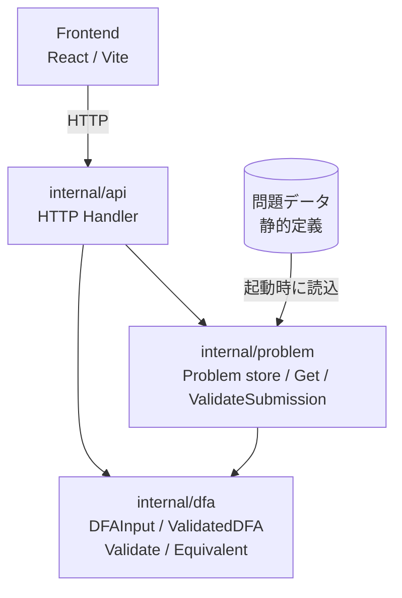
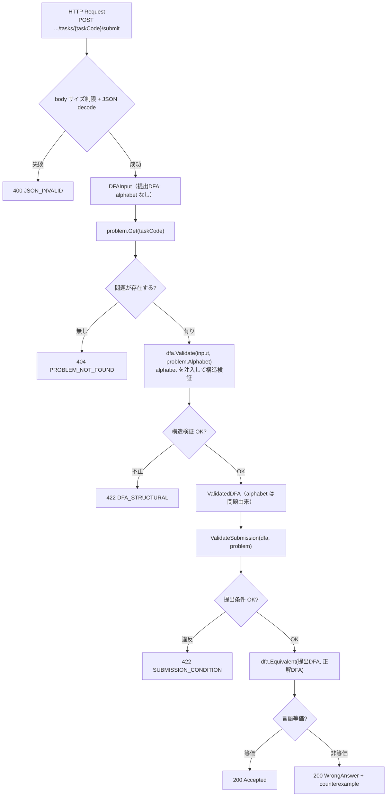
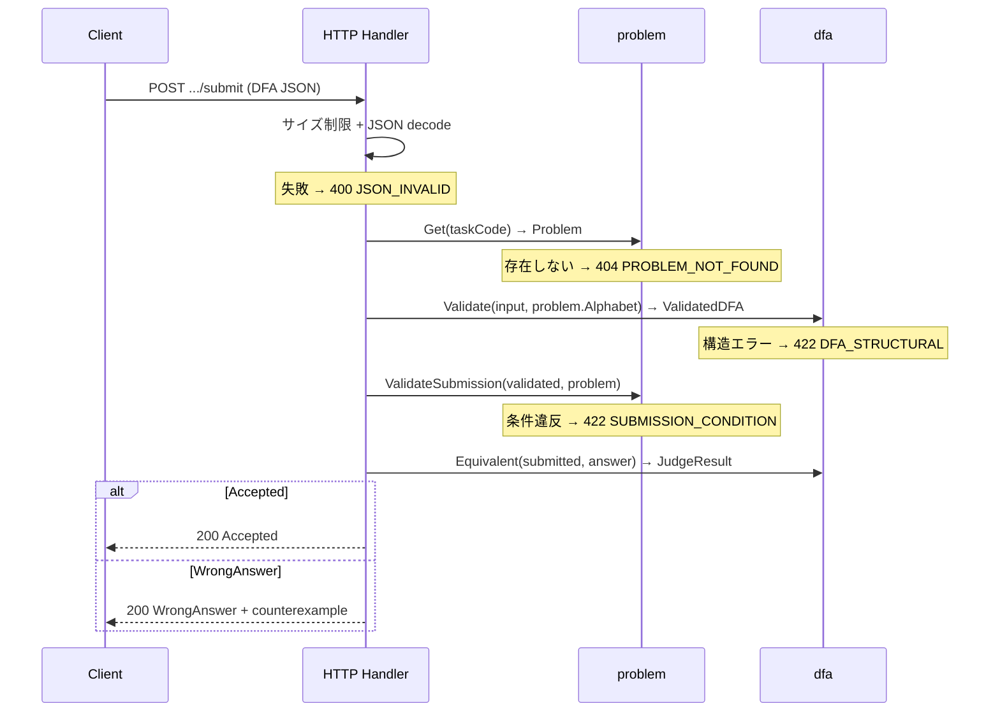

# バックエンド システム詳細設計書

## 文書情報

| 項目 | 値 |
|---|---|
| 対象 | FA Design Game バックエンド（Go / Gin）全体の詳細設計 |
| 対象Issue | [#58 DFA提出・検証・等価性判定の責務境界と処理フローを設計する](https://github.com/automaton-games/fa-design-game/issues/58) |
| 関連Issue | [#22 構造体検証](https://github.com/automaton-games/fa-design-game/issues/22)、[#54 等価性判定](https://github.com/automaton-games/fa-design-game/issues/54) |
| 関連ADR | [0001 公開識別子](../adr/0001-public-identifiers.md)、[0002 alphabetの情報源](../adr/0002-alphabet-source.md)、[0003 構造検証と提出検証の責務境界](../adr/0003-validation-boundary.md)、[0004 正解DFAのライフサイクル](../adr/0004-answer-dfa-lifecycle.md) |
| 外部契約 | [openapi.yaml](openapi.yaml)（API契約）、[DFA JSON形式](dfa-json-format.md) |
| 用語集 | [CONTEXT.md](../../CONTEXT.md) |
| バージョン | 1.0 |
| ステータス | Draft |
| 作成日 | 2026-08-03 |

> 本書はバックエンドの**内部設計**を唯一の正として記述する。HTTPの外部契約とDFAの構造スキーマは [openapi.yaml](openapi.yaml)、DFAの制約・入力要件は [DFA JSON形式](dfa-json-format.md) をそれぞれの正とし、本書はそれらを参照して重複しない（SSOT）。

---

## 1. システム概要

### 1.1 全体構成



MVPでは問題データを静的定義（コードまたはJSONファイル）で保持する（[MVP仕様](../product/mvp.md)）。データベースはMVPの対象外である。

### 1.2 パッケージと層の責務

| 層 | package | 責務 |
|---|---|---|
| HTTP/API層 | `internal/api`（仮） | ルーティング、JSONのdecode/encode、問題ストアへの問い合わせ、提出フローのオーケストレーション、エラーからHTTP status/レスポンスへの変換 |
| 問題・提出層 | `internal/problem`（仮） | `Problem`、問題データの読み込みと検証（検証済みで保持）、`Get`、提出検証（`ValidateSubmission`） |
| DFAドメイン層 | `internal/dfa` | `DFAInput`、`ValidatedDFA`、構造検証（`Validate`）、等価性判定（`Equivalent`）。問題に依存しない |

依存方向は `api → problem → dfa` と `api → dfa` で、`dfa` は葉であり循環しない。構造検証と等価性判定は `internal/dfa` に同居させる（DFAドメインの2責務）。MVPでは application/service層を置かず、HTTP handlerが直接オーケストレーションする。

### 1.3 起動と問題データの読み込み

起動時に `problem.NewStore` で問題ストアを構築し、HTTP handler へ注入する（DI）。各問題の正解DFAを読み込み時に構造検証して `ValidatedDFA` として保持する（[ADR 0004](../adr/0004-answer-dfa-lifecycle.md)）。読み込み時の検証失敗は問題データ不良であり、サーバは起動できない（または該当問題を提供しない）。提出ごとに正解DFAを再検証しない。読み込みとストアの詳細は第3節に示す。

---

## 2. 共通設計

### 2.1 エラー分類とHTTPステータス

HTTPステータスとエラーコードの完全な対応は [openapi.yaml](openapi.yaml) を正とする。本書では各処理がどのエラーを起こしうるかを、関数仕様（第3〜5節）の「エラー」欄に示す。**Wrong Answer はエラーではなく**、正常な判定結果として `200` を返す。

### 2.2 共通データ型：検証済みDFA（`ValidatedDFA`）

構造検証を通過し、有効なDFAの不変条件を満たすことが保証されたDFA。正解DFAと提出DFAの両方で使う。**フィールドは非公開**とし、構築は `Validate` 経由のみ、読み取りはアクセサ経由のみとする。これにより検証後に外部から書き換えられない。

| フィールド | 型 | 制約（不変条件） | 説明 |
|---|---|---|---|
| states | `[]string` | 1以上、重複なし、空文字/空白のみを除外 | 状態の集合 |
| alphabet | `[]string` | 1以上、重複なし（問題由来） | 入力アルファベット |
| start | `string` | `states` に含まれる | 開始状態 |
| accept | `[]string` | `states` の部分集合、重複なし（空集合可） | 受理状態の集合 |
| transitions | `map[string]map[string]string` | `states × alphabet` の完全関数、遷移先は `states`、余分な定義なし | 遷移関数 δ |

```go
type ValidatedDFA struct {
    states      []string
    alphabet    []string
    start       string
    accept      []string
    transitions map[string]map[string]string
}
```

アクセサ（外部 package 向け、必要最小限）は `StateCount() int`（状態数。提出検証の上限チェック用）。同一 package の `Equivalent` は非公開フィールドに直接アクセスする。

### 2.3 alphabet のデータフロー

alphabet の唯一の情報源は問題データ（[ADR 0002](../adr/0002-alphabet-source.md)）。提出DFAは alphabet を持たず、`dfa.Validate(input, problem.Alphabet)` が問題の alphabet を注入して構造検証を一つの操作で行う。注入を API 層でなくドメイン層の `Validate` 内で行うことで、`ValidatedDFA` の構築を検証経由に限定できる（カプセル化）。遷移の完全性は問題の alphabet で測る。結果として検証済みDFAの alphabet は常に問題データに一致し、等価性判定は alphabet 整合性を改めて検証しない。

---

## 3. 問題データ管理

### 3.1 問題モデル（`Problem`）

1つの問題を表す内部データ。正解DFAは `ValidatedDFA` として保持し、フロントエンドには返さない。

| フィールド | 型 | 制約 | 説明 |
|---|---|---|---|
| Code | `string` | 空でない | 問題コード（例: `"A"`） |
| Alphabet | `[]string` | 1以上、重複なし | 入力アルファベット（読み込み時に検証済み） |
| Answer | `ValidatedDFA` | 第2.2節の不変条件を満たす | 正解DFA |
| StateLimit | `int` | `0` は無制限 | 状態数上限など問題固有の提出制約 |
| Title | `string` | — | 問題タイトル（表示用） |
| Statement | `string` | — | 問題文（表示用） |

### 3.2 問題ストア（`Store`）と読み込み（`NewStore`）

問題ストアは、読み込み後に不変の `Problem` の集合を保持する。HTTP handler が `*Store` を保持し（DI）、提出・読み取りAPIから参照する。読み込み後に変更されないため、スレッドセーフのための追加機構は不要である。

```go
// 問題データの未検証入力（読み込み前）。
type ProblemInput struct {
    Code        string
    Alphabet   []string
    Answer     DFAInput   // 正解DFAの未検証入力
    StateLimit int
    Title      string
    Statement  string
}

type Store struct {
    // 問題コード -> Problem（読み込み後に不変）
}

// 問題データを読み込み、各問題を検証して不変のストアを構築する。起動時に一度だけ呼ぶ。
func NewStore(inputs []ProblemInput) (*Store, error)
```

- **概要**: 問題データを読み込み、各問題を検証して `*Store` を構築する。
- **事前条件**: なし。
- **事後条件**: 成功時、戻り値の `*Store` は各問題の `Answer` を検証済み `ValidatedDFA` として保持し、問題コードは一意である。失敗時、`*Store` は `nil`。
- **引数**: `inputs []ProblemInput`（問題データの未検証入力）
- **戻り値**: `(*Store, error)`
- **エラー**: 問題データ不良（`Alphabet` 不正、正解DFAの構造エラー、問題コード重複）。起動時に呼ぶため、失敗時はサーバを起動できない。
- **処理**: 各 input について次を行う（[ADR 0004](../adr/0004-answer-dfa-lifecycle.md)）。いずれかの検証が失敗した場合はその時点で `error` を返す（提出者の責任ではない）。
  1. `Alphabet` の妥当性（1以上、重複なし）を検証する。
  2. 正解DFAを `dfa.Validate(input.Answer, input.Alphabet)` で構造検証し、`ValidatedDFA` を得る。
  3. 検証済みの `Problem` をストアへ追加する。

### 3.3 問題の取得（`Store.Get`）

```go
func (s *Store) Get(taskCode string) (Problem, error)
```

- **概要**: 問題コードから `Problem` を取得する。
- **事前条件**: なし。
- **事後条件**: 成功時、戻り値の `Problem` は `Answer` を検証済み `ValidatedDFA` として保持する。
- **引数**: `taskCode string`
- **戻り値**: `(Problem, error)`
- **エラー**: 問題不存在（`PROBLEM_NOT_FOUND`、HTTP `404`）。

---

## 4. 読み取りAPI

コンテスト・問題の読み取りAPIは、問題ストアからデータを取り出して返す。レスポンス形式は [openapi.yaml](openapi.yaml) を正とする。正解DFA（`Answer`）はレスポンスに含めない。MVPでは `contestSlug` は `practice` のみ有効である。

| エンドポイント | データ元 | 備考 |
|---|---|---|
| `GET /api/contests` | 固定 | Practiceコンテストのみ |
| `GET /api/contests/{contestSlug}` | 固定 | Practiceコンテスト情報（[openapi.yaml](openapi.yaml)） |
| `GET /api/contests/{contestSlug}/tasks` | ストア | 各問題の Code / Title |
| `GET /api/contests/{contestSlug}/tasks/{taskCode}` | ストア（`Store.Get`） | Code / Title / Statement / Alphabet |

---

## 5. DFA提出・判定

### 5.1 処理フロー（分岐とHTTPステータス）



正解DFAの読み込み時検証失敗や想定外のエラーは、フロー全体を通じて **`500 INTERNAL`** に集約される（[ADR 0004](../adr/0004-answer-dfa-lifecycle.md)）。

### 5.2 層間シーケンス（オーケストレーション）



JSON decode の失敗は `400` とする。等価性判定の不一致はエラーではなく、正常な判定結果として `200` を返す。

### 5.3 データ型

提出DFA（`DFAInput`）のJSON形式・フィールド・入力要件は [DFA JSON形式](dfa-json-format.md) を正とする。本書ではGo型のみ示す。`DFAInput` は alphabet フィールドを持たない（[ADR 0002](../adr/0002-alphabet-source.md)）。JSON に `alphabet` が含まれていてもデコード時に無視される。

```go
type DFAInput struct {
    States      []string                     `json:"states"`
    Start       string                       `json:"start"`
    Accept      []string                     `json:"accept"`
    Transitions map[string]map[string]string `json:"transitions"`
}
```

判定結果（`JudgeResult`）。反例は最短で、空文字列（ε）も反例になりうる。

```go
type JudgeResult struct {
    Accepted       bool
    Counterexample string // 不正解時の最短反例。Accepted のときは空。"" は ε
}
```

HTTPレスポンスのGo型（成功・エラー）とJSON形式は [openapi.yaml](openapi.yaml) を正とする。handlerは `JudgeResult` を成功レスポンスへ、各エラーをエラーレスポンスへ変換する。

### 5.4 関数仕様

#### 5.4.1 `dfa.Validate`

```go
func Validate(input DFAInput, alphabet []string) (ValidatedDFA, error)
```

- **概要**: 問題の `alphabet` を注入し、構造検証を行って `ValidatedDFA` を構築する。
- **事前条件**: `alphabet` は問題データローダが検証済み（1以上、重複なし）。本関数は `alphabet` を再検証しない。
- **事後条件**: 成功時、戻り値の `ValidatedDFA` は第2.2節の不変条件をすべて満たし、`alphabet` は引数と一致する。失敗時、`ValidatedDFA` はゼロ値。
- **引数**: `input DFAInput`、`alphabet []string`（問題由来）
- **戻り値**: `(ValidatedDFA, error)`
- **エラー**: 構造エラー（`DFA_STRUCTURAL`、HTTP `422`）。最初の1件のみ返す。
- **処理**: 第5.5節の検査項目を順に検証し、すべて通れば `ValidatedDFA` を構築して返す。

#### 5.4.2 `problem.ValidateSubmission`

```go
func ValidateSubmission(d ValidatedDFA, p Problem) error
```

- **概要**: 提出DFAが問題固有の提出条件を満たすか検証する。
- **事前条件**: `d` は構造検証済みの `ValidatedDFA`。
- **事後条件**: `nil` なら提出条件OK。非`nil` なら提出条件エラー。
- **引数**: `d ValidatedDFA`、`p Problem`
- **戻り値**: `error`
- **エラー**: 提出条件エラー（`SUBMISSION_CONDITION`、HTTP `422`）。
- **処理**: `p.StateLimit > 0` のとき `d.StateCount() <= p.StateLimit` を検証する。今後の問題固有制約もここに追加する。

#### 5.4.3 `dfa.Equivalent`

```go
func Equivalent(submitted, answer ValidatedDFA) JudgeResult
```

- **概要**: 2つの検証済みDFAの言語等価性を判定する。
- **事前条件**: `submitted` と `answer` はともに `ValidatedDFA`。両者は同じ `alphabet` を持つ（`answer` は問題、`submitted` には問題の `alphabet` が注入済み）。
- **事後条件**: `Accepted==true` ⟺ 2つのDFAが受理する言語が一致。`Accepted==false` のとき `Counterexample` は一方だけが受理する最短文字列（ε を含む）。
- **引数**: `submitted, answer ValidatedDFA`
- **戻り値**: `JudgeResult`（エラーは返さない）
- **エラー**: なし。検証済みDFA同士の判定は有限状態で必ず完了する。
- **処理**: 2つのDFAの直積オートマトンを構成し、開始状態から到達可能な状態対を幅優先探索する。受理状態のフラグが異なる状態対が見つかれば非等価とし、そこまでの最短パスを反例として返す。1つも見つからなければ等価とする。状態数は有限なので循環を含んでも終了する。

### 5.5 構造検証の実装

構造検証（`Validate`）の検査項目と対応エラーコード。ルールの条件は [DFA JSON形式](dfa-json-format.md) を正とし、本表は実装側の対応を示す。

| 検査項目 | 対応 code | 実装（`Validate` 内） |
|---|---|---|
| states | `DFA_STRUCTURAL` | 1以上、重複なし、空文字/空白のみを除外 |
| start | `DFA_STRUCTURAL` | 空でなく `states` に含まれる |
| accept | `DFA_STRUCTURAL` | `states` の部分集合、重複なし（空集合可） |
| transitions 完全性 | `DFA_STRUCTURAL` | `states × alphabet` の全組に遷移が定義される |
| transitions 遷移先 | `DFA_STRUCTURAL` | すべての遷移先が `states` に含まれる |
| transitions 余分 | `DFA_STRUCTURAL` | `states` 以外の遷移元・`alphabet` 以外の記号の定義を拒否 |
| alphabet | （提出DFAには現れない） | 問題データローダが検証（第3.2節）。不良は `INTERNAL` |

### 5.6 現状の #22 との差分（拡張が必要）

`feature/22-add-validate` の `Validate(d DFA) error` は、重複・空文字状態名・余分な遷移を未検出である。本設計は #22 の拡張を要求する。あわせて `DFA` 型は `DFAInput` に置換し、`Validate(d DFA) error` を `Validate(input DFAInput, alphabet []string) (ValidatedDFA, error)` に変更する。

### 5.7 検証対象外の性質

以下はDFAの構造的妥当性とは無関係であり、**構造エラーの対象外**とする。制約したい場合は問題や採点ルール（提出検証）で扱う。

- 到達不能状態
- dead state / sink state
- 非最小なDFA
- 空の受理状態集合
- すべての状態が受理状態
- 正解DFAと異なる状態名や内部構造

### 5.8 正常系・異常系の具体例

- **正常系（Accepted）**: 偶数長を受理する問題へ、正解と等価なDFAを提出 → `200 {accepted:true, result:"Accepted"}`
- **正常系（WrongAnswer）**: 同問題へ、奇数長を受理するDFAを提出 → `200 {accepted:false, result:"WrongAnswer", counterexample:"0"}`
- **正常系（WrongAnswer・反例=ε）**: 空文字列だけ受理結果が異なる → `200 {accepted:false, result:"WrongAnswer", counterexample:""}`
- **異常系（構造エラー）**: `transitions` に `states` にない `q9` への遷移 → `422 {error:{code:"DFA_STRUCTURAL", message:"遷移先 \"q9\" は states に含まれません", field:"transitions"}}`
- **異常系（JSON）**: `states` に文字列ではなく数値を指定 → `400 {error:{code:"JSON_INVALID", ...}}`
- **異常系（問題不存在）**: 未知の `taskCode` への提出 → `404 {error:{code:"PROBLEM_NOT_FOUND", ...}}`

---

## 6. ヘルスチェック

`GET /health` はバックエンドの稼働状態を `{"status":"ok"}` で返す（[openapi.yaml](openapi.yaml)）。問題ストアの読み込みが完了していれば稼働中とみなす。

---

## 7. 実装順序と関連Issue

### 7.1 実装順序

1. **#22 構造検証の拡張**: 重複、空文字状態名、余分遷移の検出を追加。`DFA` 型は `DFAInput` に置換、`Validate` のシグネチャを変更。`alphabet` 非空チェックは問題ローダへ移動。
2. **問題データローダ**: 問題データの読み込みと検証、`ValidatedDFA` で保持（[ADR 0004](../adr/0004-answer-dfa-lifecycle.md)）。`alphabet` の検証もここ。`Problem`、`Get`、`ValidateSubmission` を実装。
3. **読み取りAPI**: contests、tasks、task detail の各エンドポイント。
4. **提出API（HTTP/API層）**: decode、問題取得、`Validate`→`ValidateSubmission`→`Equivalent` の接続、エラーとHTTP変換。
5. **#54 等価性判定**: `Equivalent(submitted, answer ValidatedDFA) JudgeResult` を実装。同じ `alphabet` 前提、ε反例を含む最短反例を返す。
6. **結合**: 提出から判定結果までをつなぐ。

### 7.2 関連Issueへの影響

- **#22**: 第5.5節・第5.6節の拡張要件を反映する。
- **#54**: 第5.4.3節の入力契約（検証済みDFA、同じ `alphabet`、ε反例）を反映する。

### 7.3 関連ドキュメントの整合

本設計の決定に合わせて、次の外部契約ドキュメントを整合済みである。本書とこれらはSSOTで分担する。

- [openapi.yaml](openapi.yaml): API契約（エンドポイント、スキーマ、ステータスコード、エラー）の正。
- [DFA JSON形式](dfa-json-format.md): DFAのデータ形式・フィールド・入力要件の正。
- [CONTEXT.md](../../CONTEXT.md): ドメイン用語の正。
